# 📊 Superstore Sales Analysis

**A comprehensive analysis of retail sales data to identify trends, optimize discount strategies, and segment customers for targeted marketing**

---

## 🔗 Quick Links
- **GitHub Repository**: [jeans-all/superstore_sales_anlaysis](https:github.com/jeans-all)
- **LinkedIn**: [jeans-all](https://linkedin.com/in/jeans-all)

---

## 🛠️ Technologies Used
`Python` `Pandas` `NumPy` `Matplotlib` `Seaborn` `Google Colab`

---

## 📑 Table of Contents
1. Project Overview
2. Dataset Description
3. Data Exploration & Cleaning
4. Key Findings
5. Business Recommendations
6. Challenges & Learnings
7. Technical Implementation
---

## 1. Project Overview

### 🎯 Business Context
A retail company needs to understand their sales performance, optimize pricing strategies, and improve customer retention to increase profitability.

### 🎯 Objectives
1. Analyze sales trends and patterns over time
2. Evaluate the impact of discount strategies on profitability
3. Identify customer purchasing behavior patterns
4. Segment customers for targeted marketing campaigns

### 📊 Key Questions
- What are the sales trends and seasonal patterns?
- How do discounts affect profit margins?
- When do customers prefer to shop?
- Who are our most valuable customers?

---

## 2. Dataset Description

### 📁 Data Source
- **Source**: [Superstore Sales Dataset](https://www.kaggle.com/datasets/vivek468/superstore-dataset-final)
- **Size**: ~10,000 transactions
- **Time Period**: 2014-2017 (4 years)
- **Geographic Scope**: United States (multiple regions and states)

### 📋 Features
The dataset contains **21 columns** including:

**Order Information:**
- Order ID, Order Date, Ship Date, Ship Mode

**Customer Information:**
- Customer ID, Customer Name, Segment

**Location:**
- Country, City, State, Postal Code, Region

**Product Information:**
- Product ID, Category, Sub-Category, Product Name

**Financial Metrics:**
- Sales, Quantity, Discount, Profit

---

## 3. Data Exploration & Cleaning

### 🔧 Environment Setup


```python
from google.colab import drive
drive.mount('/content/drive')

try:
  !mkdir -p "/content/drive/MyDrive/data_projects/superstore/data"
  !mkdir -p "/content/drive/MyDrive/data_projects/superstore/notebooks"
  !mkdir -p "/content/drive/MyDrive/data_projects/superstore/outputs"
except Error:
  print("Directories already exist")


# Import libraries
import pandas as pd
import numpy as np
import matplotlib.pyplot as plt
import seaborn as sns
from datetime import datetime

# Set display options
pd.set_option('display.max_columns', None)
pd.set_option('display.max_rows', 100)
plt.style.use('seaborn-v0_8-darkgrid')
plt.rcParams['figure.figsize'] = (12, 6)
sns.set_palette('husl')

# Read CSV file from the mounted drive
df = pd.read_csv('/content/drive/My Drive/data_projects/superstore/data/Sample - Superstore.csv', encoding='latin')

# Test data load
print("Setup Complete!")
print(f"Dataset Shape: {df.shape}")
print(f"Data Range: {df['Order Date'].min()} to {df['Order Date'].max()}")
print("\n📊 First 5 Rows:")
display(df.head())

```

    Drive already mounted at /content/drive; to attempt to forcibly remount, call drive.mount("/content/drive", force_remount=True).
    Setup Complete!
    Dataset Shape: (9994, 21)
    Data Range: 1/1/2017 to 9/9/2017
    
    📊 First 5 Rows:
    


  <div id="df-4c668c6a-bd83-426a-aada-d2b7e21d9cb0" class="colab-df-container">
    <div>
<style scoped>
    .dataframe tbody tr th:only-of-type {
        vertical-align: middle;
    }

    .dataframe tbody tr th {
        vertical-align: top;
    }

    .dataframe thead th {
        text-align: right;
    }
</style>
<table border="1" class="dataframe">
  <thead>
    <tr style="text-align: right;">
      <th></th>
      <th>Row ID</th>
      <th>Order ID</th>
      <th>Order Date</th>
      <th>Ship Date</th>
      <th>Ship Mode</th>
      <th>Customer ID</th>
      <th>Customer Name</th>
      <th>Segment</th>
      <th>Country</th>
      <th>City</th>
      <th>State</th>
      <th>Postal Code</th>
      <th>Region</th>
      <th>Product ID</th>
      <th>Category</th>
      <th>Sub-Category</th>
      <th>Product Name</th>
      <th>Sales</th>
      <th>Quantity</th>
      <th>Discount</th>
      <th>Profit</th>
    </tr>
  </thead>
  <tbody>
    <tr>
      <th>0</th>
      <td>1</td>
      <td>CA-2016-152156</td>
      <td>11/8/2016</td>
      <td>11/11/2016</td>
      <td>Second Class</td>
      <td>CG-12520</td>
      <td>Claire Gute</td>
      <td>Consumer</td>
      <td>United States</td>
      <td>Henderson</td>
      <td>Kentucky</td>
      <td>42420</td>
      <td>South</td>
      <td>FUR-BO-10001798</td>
      <td>Furniture</td>
      <td>Bookcases</td>
      <td>Bush Somerset Collection Bookcase</td>
      <td>261.9600</td>
      <td>2</td>
      <td>0.00</td>
      <td>41.9136</td>
    </tr>
    <tr>
      <th>1</th>
      <td>2</td>
      <td>CA-2016-152156</td>
      <td>11/8/2016</td>
      <td>11/11/2016</td>
      <td>Second Class</td>
      <td>CG-12520</td>
      <td>Claire Gute</td>
      <td>Consumer</td>
      <td>United States</td>
      <td>Henderson</td>
      <td>Kentucky</td>
      <td>42420</td>
      <td>South</td>
      <td>FUR-CH-10000454</td>
      <td>Furniture</td>
      <td>Chairs</td>
      <td>Hon Deluxe Fabric Upholstered Stacking Chairs,...</td>
      <td>731.9400</td>
      <td>3</td>
      <td>0.00</td>
      <td>219.5820</td>
    </tr>
    <tr>
      <th>2</th>
      <td>3</td>
      <td>CA-2016-138688</td>
      <td>6/12/2016</td>
      <td>6/16/2016</td>
      <td>Second Class</td>
      <td>DV-13045</td>
      <td>Darrin Van Huff</td>
      <td>Corporate</td>
      <td>United States</td>
      <td>Los Angeles</td>
      <td>California</td>
      <td>90036</td>
      <td>West</td>
      <td>OFF-LA-10000240</td>
      <td>Office Supplies</td>
      <td>Labels</td>
      <td>Self-Adhesive Address Labels for Typewriters b...</td>
      <td>14.6200</td>
      <td>2</td>
      <td>0.00</td>
      <td>6.8714</td>
    </tr>
    <tr>
      <th>3</th>
      <td>4</td>
      <td>US-2015-108966</td>
      <td>10/11/2015</td>
      <td>10/18/2015</td>
      <td>Standard Class</td>
      <td>SO-20335</td>
      <td>Sean O'Donnell</td>
      <td>Consumer</td>
      <td>United States</td>
      <td>Fort Lauderdale</td>
      <td>Florida</td>
      <td>33311</td>
      <td>South</td>
      <td>FUR-TA-10000577</td>
      <td>Furniture</td>
      <td>Tables</td>
      <td>Bretford CR4500 Series Slim Rectangular Table</td>
      <td>957.5775</td>
      <td>5</td>
      <td>0.45</td>
      <td>-383.0310</td>
    </tr>
    <tr>
      <th>4</th>
      <td>5</td>
      <td>US-2015-108966</td>
      <td>10/11/2015</td>
      <td>10/18/2015</td>
      <td>Standard Class</td>
      <td>SO-20335</td>
      <td>Sean O'Donnell</td>
      <td>Consumer</td>
      <td>United States</td>
      <td>Fort Lauderdale</td>
      <td>Florida</td>
      <td>33311</td>
      <td>South</td>
      <td>OFF-ST-10000760</td>
      <td>Office Supplies</td>
      <td>Storage</td>
      <td>Eldon Fold 'N Roll Cart System</td>
      <td>22.3680</td>
      <td>2</td>
      <td>0.20</td>
      <td>2.5164</td>
    </tr>
  </tbody>
</table>
</div>
    <div class="colab-df-buttons">

  <div class="colab-df-container">
    <button class="colab-df-convert" onclick="convertToInteractive('df-4c668c6a-bd83-426a-aada-d2b7e21d9cb0')"
            title="Convert this dataframe to an interactive table."
            style="display:none;">

  <svg xmlns="http://www.w3.org/2000/svg" height="24px" viewBox="0 -960 960 960">
    <path d="M120-120v-720h720v720H120Zm60-500h600v-160H180v160Zm220 220h160v-160H400v160Zm0 220h160v-160H400v160ZM180-400h160v-160H180v160Zm440 0h160v-160H620v160ZM180-180h160v-160H180v160Zm440 0h160v-160H620v160Z"/>
  </svg>
    </button>

  <style>
    .colab-df-container {
      display:flex;
      gap: 12px;
    }

    .colab-df-convert {
      background-color: #E8F0FE;
      border: none;
      border-radius: 50%;
      cursor: pointer;
      display: none;
      fill: #1967D2;
      height: 32px;
      padding: 0 0 0 0;
      width: 32px;
    }

    .colab-df-convert:hover {
      background-color: #E2EBFA;
      box-shadow: 0px 1px 2px rgba(60, 64, 67, 0.3), 0px 1px 3px 1px rgba(60, 64, 67, 0.15);
      fill: #174EA6;
    }

    .colab-df-buttons div {
      margin-bottom: 4px;
    }

    [theme=dark] .colab-df-convert {
      background-color: #3B4455;
      fill: #D2E3FC;
    }

    [theme=dark] .colab-df-convert:hover {
      background-color: #434B5C;
      box-shadow: 0px 1px 3px 1px rgba(0, 0, 0, 0.15);
      filter: drop-shadow(0px 1px 2px rgba(0, 0, 0, 0.3));
      fill: #FFFFFF;
    }
  </style>

    <script>
      const buttonEl =
        document.querySelector('#df-4c668c6a-bd83-426a-aada-d2b7e21d9cb0 button.colab-df-convert');
      buttonEl.style.display =
        google.colab.kernel.accessAllowed ? 'block' : 'none';

      async function convertToInteractive(key) {
        const element = document.querySelector('#df-4c668c6a-bd83-426a-aada-d2b7e21d9cb0');
        const dataTable =
          await google.colab.kernel.invokeFunction('convertToInteractive',
                                                    [key], {});
        if (!dataTable) return;

        const docLinkHtml = 'Like what you see? Visit the ' +
          '<a target="_blank" href=https://colab.research.google.com/notebooks/data_table.ipynb>data table notebook</a>'
          + ' to learn more about interactive tables.';
        element.innerHTML = '';
        dataTable['output_type'] = 'display_data';
        await google.colab.output.renderOutput(dataTable, element);
        const docLink = document.createElement('div');
        docLink.innerHTML = docLinkHtml;
        element.appendChild(docLink);
      }
    </script>
  </div>


    <div id="df-fe939e4b-c2e2-42d8-99e9-b746d9a8a319">
      <button class="colab-df-quickchart" onclick="quickchart('df-fe939e4b-c2e2-42d8-99e9-b746d9a8a319')"
                title="Suggest charts"
                style="display:none;">

<svg xmlns="http://www.w3.org/2000/svg" height="24px"viewBox="0 0 24 24"
     width="24px">
    <g>
        <path d="M19 3H5c-1.1 0-2 .9-2 2v14c0 1.1.9 2 2 2h14c1.1 0 2-.9 2-2V5c0-1.1-.9-2-2-2zM9 17H7v-7h2v7zm4 0h-2V7h2v10zm4 0h-2v-4h2v4z"/>
    </g>
</svg>
      </button>

<style>
  .colab-df-quickchart {
      --bg-color: #E8F0FE;
      --fill-color: #1967D2;
      --hover-bg-color: #E2EBFA;
      --hover-fill-color: #174EA6;
      --disabled-fill-color: #AAA;
      --disabled-bg-color: #DDD;
  }

  [theme=dark] .colab-df-quickchart {
      --bg-color: #3B4455;
      --fill-color: #D2E3FC;
      --hover-bg-color: #434B5C;
      --hover-fill-color: #FFFFFF;
      --disabled-bg-color: #3B4455;
      --disabled-fill-color: #666;
  }

  .colab-df-quickchart {
    background-color: var(--bg-color);
    border: none;
    border-radius: 50%;
    cursor: pointer;
    display: none;
    fill: var(--fill-color);
    height: 32px;
    padding: 0;
    width: 32px;
  }

  .colab-df-quickchart:hover {
    background-color: var(--hover-bg-color);
    box-shadow: 0 1px 2px rgba(60, 64, 67, 0.3), 0 1px 3px 1px rgba(60, 64, 67, 0.15);
    fill: var(--button-hover-fill-color);
  }

  .colab-df-quickchart-complete:disabled,
  .colab-df-quickchart-complete:disabled:hover {
    background-color: var(--disabled-bg-color);
    fill: var(--disabled-fill-color);
    box-shadow: none;
  }

  .colab-df-spinner {
    border: 2px solid var(--fill-color);
    border-color: transparent;
    border-bottom-color: var(--fill-color);
    animation:
      spin 1s steps(1) infinite;
  }

  @keyframes spin {
    0% {
      border-color: transparent;
      border-bottom-color: var(--fill-color);
      border-left-color: var(--fill-color);
    }
    20% {
      border-color: transparent;
      border-left-color: var(--fill-color);
      border-top-color: var(--fill-color);
    }
    30% {
      border-color: transparent;
      border-left-color: var(--fill-color);
      border-top-color: var(--fill-color);
      border-right-color: var(--fill-color);
    }
    40% {
      border-color: transparent;
      border-right-color: var(--fill-color);
      border-top-color: var(--fill-color);
    }
    60% {
      border-color: transparent;
      border-right-color: var(--fill-color);
    }
    80% {
      border-color: transparent;
      border-right-color: var(--fill-color);
      border-bottom-color: var(--fill-color);
    }
    90% {
      border-color: transparent;
      border-bottom-color: var(--fill-color);
    }
  }
</style>

      <script>
        async function quickchart(key) {
          const quickchartButtonEl =
            document.querySelector('#' + key + ' button');
          quickchartButtonEl.disabled = true;  // To prevent multiple clicks.
          quickchartButtonEl.classList.add('colab-df-spinner');
          try {
            const charts = await google.colab.kernel.invokeFunction(
                'suggestCharts', [key], {});
          } catch (error) {
            console.error('Error during call to suggestCharts:', error);
          }
          quickchartButtonEl.classList.remove('colab-df-spinner');
          quickchartButtonEl.classList.add('colab-df-quickchart-complete');
        }
        (() => {
          let quickchartButtonEl =
            document.querySelector('#df-fe939e4b-c2e2-42d8-99e9-b746d9a8a319 button');
          quickchartButtonEl.style.display =
            google.colab.kernel.accessAllowed ? 'block' : 'none';
        })();
      </script>
    </div>

    </div>
  </div>


### 🔍 Initial Data Quality Assessment

Checking for:
- Missing values
- Data types
- Duplicates

Preprocessing for:
- Order date (adding temporal columns)
- Sort data by drder date


```python
# Missing values
print("\nMissing Values:")
missing = df.isnull().sum()
missing_pct = (missing / len(df)) * 100

missing_df = pd.DataFrame({
    'Column': df.columns,
    'Missing_Count': missing.values,
    'Missing_Percentage': missing_pct.values
})

missing_df = missing_df[missing_df['Missing_Count'] > 0].sort_values('Missing_Count', ascending=False)

if len(missing_df) > 0:
    print(missing_df.to_string(index=False))
else:
    print("No missing values found!")

# Duplicates
df_clean = df.copy()
duplicates = df_clean.duplicated().sum()
print(f"\nDuplicate rows: {duplicates}")

if duplicates > 0:
    df_clean = df_clean.drop_duplicates()
    print(f"✅ Removed {duplicates} duplicate rows")


# Data types
print("\nData Types:")
print(df.dtypes)

print("\nShip Date and Order Date are of object type. They need to be converted to datetime:\n")
for col in ["Ship Date", "Order Date"]:
      df_clean[col] = pd.to_datetime(df_clean[col])
      print(f"✅ Converted {col} to datetime")


# Add useful columns
print("\nAdd temporal columns for Order Date")
df_clean['Year'] = df_clean['Order Date'].dt.year
df_clean['Month'] = df_clean['Order Date'].dt.month
df_clean['Month_Name'] = df_clean['Order Date'].dt.strftime('%B')
df_clean['Quarter'] = df_clean['Order Date'].dt.quarter
df_clean['Day_of_Week'] = df_clean['Order Date'].dt.day_name()
df_clean['Year_Month'] = df_clean['Order Date'].dt.to_period('M')

print("\n✅ Created time-based columns for each order: Year, Month, Quarter, Day_of_Week")

# Sort by order date
df_clean = df_clean.sort_values('Order Date').reset_index(drop=True)
print("✅ Sorted by Order Date")

```

    
    Missing Values:
    No missing values found!
    
    Duplicate rows: 0
    
    Data Types:
    Row ID             int64
    Order ID          object
    Order Date        object
    Ship Date         object
    Ship Mode         object
    Customer ID       object
    Customer Name     object
    Segment           object
    Country           object
    City              object
    State             object
    Postal Code        int64
    Region            object
    Product ID        object
    Category          object
    Sub-Category      object
    Product Name      object
    Sales            float64
    Quantity           int64
    Discount         float64
    Profit           float64
    dtype: object
    
    Ship Date and Order Date are of object type. They need to be converted to datetime:
    
    ✅ Converted Ship Date to datetime
    ✅ Converted Order Date to datetime
    
    Add temporal columns for Order Date
    
    ✅ Created time-based columns for each order: Year, Month, Quarter, Day_of_Week
    ✅ Sorted by Order Date
    


```python
# CATEGORICAL COLUMNS ANALYSIS
print("\n📑 Categorical Columns:")
categorical_cols = df.select_dtypes(include=['object']).columns

for col in categorical_cols:
    print(f"\n{col}:")
    print(f"  Unique values: {df[col].nunique()}")
    print(f"  Top 5 values:")
    print(df[col].value_counts().head())
```

    
    📑 Categorical Columns:
    
    Order ID:
      Unique values: 5009
      Top 5 values:
    Order ID
    CA-2017-100111    14
    CA-2017-157987    12
    CA-2016-165330    11
    US-2016-108504    11
    US-2015-126977    10
    Name: count, dtype: int64
    
    Order Date:
      Unique values: 1237
      Top 5 values:
    Order Date
    9/5/2016      38
    9/2/2017      36
    11/10/2016    35
    12/1/2017     34
    12/2/2017     34
    Name: count, dtype: int64
    
    Ship Date:
      Unique values: 1334
      Top 5 values:
    Ship Date
    12/16/2015    35
    9/26/2017     34
    11/21/2017    32
    12/6/2017     32
    9/6/2017      30
    Name: count, dtype: int64
    
    Ship Mode:
      Unique values: 4
      Top 5 values:
    Ship Mode
    Standard Class    5968
    Second Class      1945
    First Class       1538
    Same Day           543
    Name: count, dtype: int64
    
    Customer ID:
      Unique values: 793
      Top 5 values:
    Customer ID
    WB-21850    37
    MA-17560    34
    JL-15835    34
    PP-18955    34
    CK-12205    32
    Name: count, dtype: int64
    
    Customer Name:
      Unique values: 793
      Top 5 values:
    Customer Name
    William Brown          37
    Matt Abelman           34
    John Lee               34
    Paul Prost             34
    Chloris Kastensmidt    32
    Name: count, dtype: int64
    
    Segment:
      Unique values: 3
      Top 5 values:
    Segment
    Consumer       5191
    Corporate      3020
    Home Office    1783
    Name: count, dtype: int64
    
    Country:
      Unique values: 1
      Top 5 values:
    Country
    United States    9994
    Name: count, dtype: int64
    
    City:
      Unique values: 531
      Top 5 values:
    City
    New York City    915
    Los Angeles      747
    Philadelphia     537
    San Francisco    510
    Seattle          428
    Name: count, dtype: int64
    
    State:
      Unique values: 49
      Top 5 values:
    State
    California      2001
    New York        1128
    Texas            985
    Pennsylvania     587
    Washington       506
    Name: count, dtype: int64
    
    Region:
      Unique values: 4
      Top 5 values:
    Region
    West       3203
    East       2848
    Central    2323
    South      1620
    Name: count, dtype: int64
    
    Product ID:
      Unique values: 1862
      Top 5 values:
    Product ID
    OFF-PA-10001970    19
    TEC-AC-10003832    18
    FUR-FU-10004270    16
    FUR-CH-10002647    15
    FUR-CH-10001146    15
    Name: count, dtype: int64
    
    Category:
      Unique values: 3
      Top 5 values:
    Category
    Office Supplies    6026
    Furniture          2121
    Technology         1847
    Name: count, dtype: int64
    
    Sub-Category:
      Unique values: 17
      Top 5 values:
    Sub-Category
    Binders        1523
    Paper          1370
    Furnishings     957
    Phones          889
    Storage         846
    Name: count, dtype: int64
    
    Product Name:
      Unique values: 1850
      Top 5 values:
    Product Name
    Staple envelope            48
    Staples                    46
    Easy-staple paper          46
    Avery Non-Stick Binders    20
    Staples in misc. colors    19
    Name: count, dtype: int64
    

### 💡 Important Discovery: Understanding Data Structure

**Observation:** Order IDs appear multiple times in the dataset.

**Investigation:** Each row represents a **product line item** within an order, not a complete order. One order can contain multiple products.

**Impact on Analysis:**
- Adjusted metrics calculation (e.g., average order value requires aggregation by Order ID)
- Prevented incorrect duplicate removal
- Enabled proper order-level vs product-level analysis

This understanding was crucial for accurate business metrics calculation.

---

## 4. Key Findings & Insights

### 📊 Executive Summary - Key Performance Indicators

Before diving into detailed insights, here's a snapshot of the overall business performance:

#### 💰 Financial Performance
- **Total Sales:** \$2,297,200.86
- **Total Profit:** \$286,397.02
- **Overall Profit Margin:** 12.47%

#### 📦 Order Metrics
- **Total Orders:** 5,009
- **Average Order Value:** \$458.61
- **Average Profit per Order:** \$57.18

#### 👥 Customer & Product Insights
- **Total Customers:** 793
- **Total Products:** 1,862
- **Average Orders per Customer:** 6.32
- **Time Period:** 2014-2017 (4 years)

---

### 🔍 Detailed Analysis

The analysis revealed four critical business insights that require immediate attention:

---


```python
# KEY Business Metrics

# Overall metrics
total_sales = df_clean['Sales'].sum()
total_profit = df_clean['Profit'].sum()
total_orders = df_clean['Order ID'].nunique()
total_customers = df_clean['Customer ID'].nunique()
total_products = df_clean['Product ID'].nunique()

profit_margin = (total_profit / total_sales) * 100
avg_order_value = total_sales / total_orders
avg_profit_per_order = total_profit / total_orders

# print(f"\nFinancial Metrics:")
# print(f"  Total Sales: ${total_sales:,.2f}")
# print(f"  Total Profit: ${total_profit:,.2f}")
# print(f"  Profit Margin: {profit_margin:.2f}%")

# print(f"\nOrder Metrics:")
# print(f"  Total Orders: {total_orders:,}")
# print(f"  Average Order Value: ${avg_order_value:,.2f}")
# print(f"  Average Profit per Order: ${avg_profit_per_order:,.2f}")

# print(f"\nCustomer & Product Metrics:")
# print(f"  Total Customers: {total_customers:,}")
# print(f"  Total Products: {total_products:,}")
# print(f"  Average Orders per Customer: {total_orders/total_customers:.2f}")

fig, axes = plt.subplots(2, 3, figsize=(15, 8))
fig.suptitle('Key Performance Indicators Dashboard', fontsize=16, fontweight='bold')

# KPI 1: Total Sales
axes[0, 0].text(0.5, 0.5, f'${total_sales/1e6:.2f}M',
                ha='center', va='center', fontsize=24, fontweight='bold', color='green')
axes[0, 0].text(0.5, 0.2, 'Total Sales', ha='center', va='center', fontsize=12)
axes[0, 0].axis('off')

# KPI 2: Total Profit
axes[0, 1].text(0.5, 0.5, f'${total_profit/1e6:.2f}M',
                ha='center', va='center', fontsize=24, fontweight='bold', color='darkgreen')
axes[0, 1].text(0.5, 0.2, 'Total Profit', ha='center', va='center', fontsize=12)
axes[0, 1].axis('off')

# KPI 3: Profit Margin
axes[0, 2].text(0.5, 0.5, f'{profit_margin:.1f}%',
                ha='center', va='center', fontsize=24, fontweight='bold', color='blue')
axes[0, 2].text(0.5, 0.2, 'Profit Margin', ha='center', va='center', fontsize=12)
axes[0, 2].axis('off')

# KPI 4: Total Orders
axes[1, 0].text(0.5, 0.5, f'{total_orders:,}',
                ha='center', va='center', fontsize=24, fontweight='bold', color='orange')
axes[1, 0].text(0.5, 0.2, 'Total Orders', ha='center', va='center', fontsize=12)
axes[1, 0].axis('off')

# KPI 5: Total Customers
axes[1, 1].text(0.5, 0.5, f'{total_customers:,}',
                ha='center', va='center', fontsize=24, fontweight='bold', color='purple')
axes[1, 1].text(0.5, 0.2, 'Total Customers', ha='center', va='center', fontsize=12)
axes[1, 1].axis('off')

# KPI 6: Avg Order Value
axes[1, 2].text(0.5, 0.5, f'${avg_order_value:.0f}',
                ha='center', va='center', fontsize=24, fontweight='bold', color='teal')
axes[1, 2].text(0.5, 0.2, 'Avg Order Value', ha='center', va='center', fontsize=12)
axes[1, 2].axis('off')

plt.tight_layout()
plt.show()
```


    
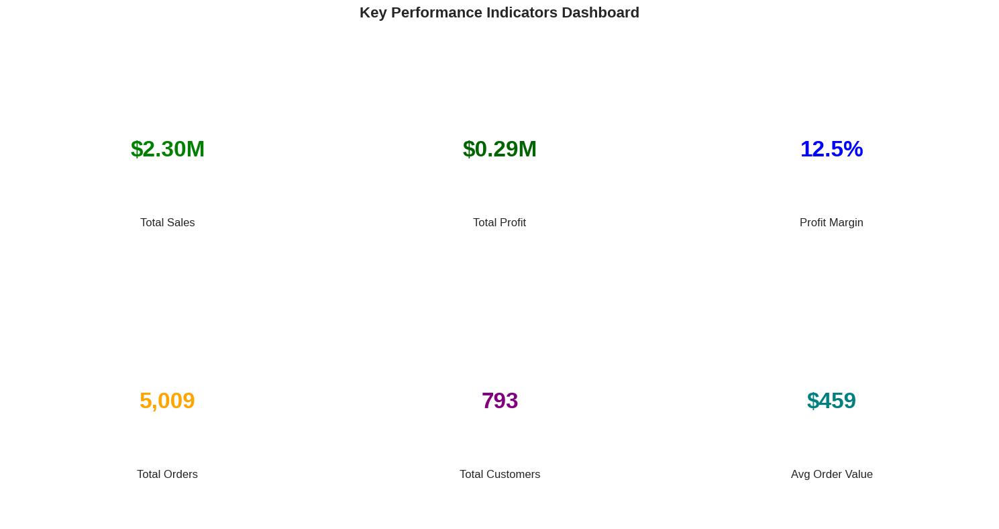
    


---

### 🔍 Deep Dive: Four Critical Insights

Now let's explore the detailed findings that reveal opportunities for improvement:

---

### 4.1 📅 Purchase Pattern Analysis: When Do Customers Buy?

**Business Question:** When should we schedule promotions and ensure adequate staffing?


```python
# ============================================
# PURCHASE PATTERN ANALYSIS: WHEN DO CUSTOMERS BUY?
# ============================================

# Day of week analysis
df_clean['Day_of_Week'] = df_clean['Order Date'].dt.day_name()
df_clean['Day_Number'] = df_clean['Order Date'].dt.dayofweek  # Monday=0, Sunday=6

# Aggregate by day of week
daily_pattern = df_clean.groupby('Day_of_Week').agg({
    'Sales': 'sum',
    'Order ID': 'nunique',
    'Profit': 'sum'
}).reset_index()

# Sort by day order (Monday to Sunday)
day_order = ['Monday', 'Tuesday', 'Wednesday', 'Thursday', 'Friday', 'Saturday', 'Sunday']
daily_pattern['Day_of_Week'] = pd.Categorical(daily_pattern['Day_of_Week'], categories=day_order, ordered=True)
daily_pattern = daily_pattern.sort_values('Day_of_Week')

# Visualize
fig, axes = plt.subplots(1, 2, figsize=(14, 5))

# Sales by day
axes[0].bar(daily_pattern['Day_of_Week'], daily_pattern['Sales'], color='steelblue', alpha=0.7)
axes[0].set_title('Sales by Day of Week', fontweight='bold')
axes[0].set_ylabel('Total Sales ($)')
axes[0].tick_params(axis='x', rotation=45)

# Orders by day
axes[1].bar(daily_pattern['Day_of_Week'], daily_pattern['Order ID'], color='coral', alpha=0.7)
axes[1].set_title('Number of Orders by Day of Week', fontweight='bold')
axes[1].set_ylabel('Number of Orders')
axes[1].tick_params(axis='x', rotation=45)

plt.tight_layout()
plt.show()

# Key insights
best_day = daily_pattern.loc[daily_pattern['Sales'].idxmax(), 'Day_of_Week']
worst_day = daily_pattern.loc[daily_pattern['Sales'].idxmin(), 'Day_of_Week']
weekend_sales = daily_pattern[daily_pattern['Day_of_Week'].isin(['Saturday', 'Sunday'])]['Sales'].sum()
weekday_sales = daily_pattern[~daily_pattern['Day_of_Week'].isin(['Saturday', 'Sunday'])]['Sales'].sum()

print(f"\n💡 KEY INSIGHTS:")
print(f"  • Best sales day: {best_day}")
print(f"  • Worst sales day: {worst_day}")
print(f"  • Weekend vs Weekday: Weekend accounts for {weekend_sales/(weekend_sales+weekday_sales)*100:.1f}% of sales")
```


    
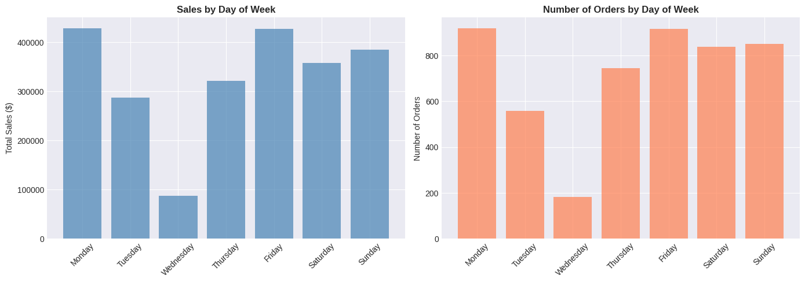
    


    
    💡 KEY INSIGHTS:
      • Best sales day: Monday
      • Worst sales day: Wednesday
      • Weekend vs Weekday: Weekend accounts for 32.4% of sales
    

#### 💡 Key Insights:
- **Best performing day:** Monday
- **Worst performing day:** Wednesday (significantly lower sales)
- **Weekend vs Weekday:** Weekend accounts for 32.4% of sales

#### 📈 Business Impact:
- Schedule promotions on high-traffic days
- Investigate Wednesday performance drop
- Optimize staffing based on daily patterns
- Consider special Wednesday campaigns to boost sales

---

### 4.2 💰 Discount Impact on Profitability

**Business Question:** Are our discount strategies profitable, or are we losing money?

**Critical Finding:** High discounts (>50%) are destroying profitability.


```python
# DISCOUNT IMPACT ON PROFITABILITY

# Create discount bins for analysis
df_clean['Discount_Range'] = pd.cut(df_clean['Discount'],
                                     bins=[-0.01, 0, 0.1, 0.2, 0.3, 0.5, 1.0],
                                     labels=['No Discount', '1-10%', '11-20%', '21-30%', '31-50%', '>50%'])

# Calculate metrics by discount range
discount_analysis = df_clean.groupby('Discount_Range').agg({
    'Sales': 'sum',
    'Profit': 'sum',
    'Order ID': 'nunique',
    'Quantity': 'sum'
}).reset_index()

# Calculate profit margin for each discount range
discount_analysis['Profit_Margin'] = (discount_analysis['Profit'] / discount_analysis['Sales'] * 100)
discount_analysis['Avg_Order_Value'] = discount_analysis['Sales'] / discount_analysis['Order ID']

# Visualize
fig, axes = plt.subplots(2, 2, figsize=(14, 10))

# 1. Sales by Discount Range
axes[0,0].bar(discount_analysis['Discount_Range'], discount_analysis['Sales'], color='skyblue', alpha=0.7)
axes[0,0].set_title('Total Sales by Discount Range', fontweight='bold')
axes[0,0].set_ylabel('Sales ($)')
axes[0,0].tick_params(axis='x', rotation=45)

# 2. Profit by Discount Range
colors = ['green' if x > 0 else 'red' for x in discount_analysis['Profit']]
axes[0,1].bar(discount_analysis['Discount_Range'], discount_analysis['Profit'], color=colors, alpha=0.7)
axes[0,1].set_title('Total Profit by Discount Range', fontweight='bold')
axes[0,1].set_ylabel('Profit ($)')
axes[0,1].tick_params(axis='x', rotation=45)
axes[0,1].axhline(y=0, color='black', linestyle='-', linewidth=0.5)

# 3. Profit Margin by Discount Range
axes[1,0].bar(discount_analysis['Discount_Range'], discount_analysis['Profit_Margin'], color='gold', alpha=0.7)
axes[1,0].set_title('Profit Margin % by Discount Range', fontweight='bold')
axes[1,0].set_ylabel('Profit Margin (%)')
axes[1,0].tick_params(axis='x', rotation=45)
axes[1,0].axhline(y=0, color='black', linestyle='-', linewidth=0.5)

# 4. Number of Orders by Discount Range
axes[1,1].bar(discount_analysis['Discount_Range'], discount_analysis['Order ID'], color='coral', alpha=0.7)
axes[1,1].set_title('Number of Orders by Discount Range', fontweight='bold')
axes[1,1].set_ylabel('Number of Orders')
axes[1,1].tick_params(axis='x', rotation=45)

plt.tight_layout()
plt.show()

# Display summary table
print("\n📊 DISCOUNT IMPACT SUMMARY:")
print("="*80)
display(discount_analysis.style.format({
    'Sales': '${:,.0f}',
    'Profit': '${:,.0f}',
    'Profit_Margin': '{:.1f}%',
    'Avg_Order_Value': '${:,.2f}',
    'Quantity': '{:,.0f}'
}))

# Key insights
no_discount_margin = discount_analysis[discount_analysis['Discount_Range'] == 'No Discount']['Profit_Margin'].values[0]
high_discount_margin = discount_analysis[discount_analysis['Discount_Range'] == '>50%']['Profit_Margin'].values[0]

# print(f"\n💡 KEY INSIGHTS:")
# print(f"  • No discount profit margin: {no_discount_margin:.1f}%")
# print(f"  • High discount (>50%) profit margin: {high_discount_margin:.1f}%")
# print(f"  • Impact: {abs(high_discount_margin - no_discount_margin):.1f}% margin reduction with aggressive discounting")
```

    /tmp/ipython-input-3420189513.py:9: FutureWarning: The default of observed=False is deprecated and will be changed to True in a future version of pandas. Pass observed=False to retain current behavior or observed=True to adopt the future default and silence this warning.
      discount_analysis = df_clean.groupby('Discount_Range').agg({
    


    
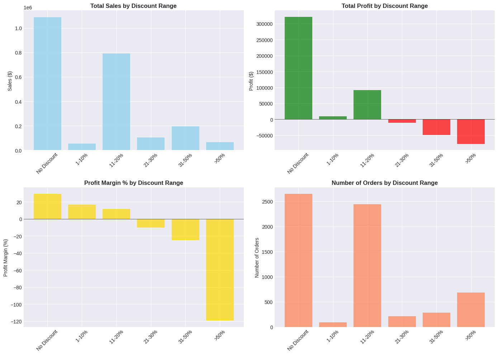
    


    
    📊 DISCOUNT IMPACT SUMMARY:
    ================================================================================
    


<style type="text/css">
</style>
<table id="T_1d243" class="dataframe">
  <thead>
    <tr>
      <th class="blank level0" >&nbsp;</th>
      <th id="T_1d243_level0_col0" class="col_heading level0 col0" >Discount_Range</th>
      <th id="T_1d243_level0_col1" class="col_heading level0 col1" >Sales</th>
      <th id="T_1d243_level0_col2" class="col_heading level0 col2" >Profit</th>
      <th id="T_1d243_level0_col3" class="col_heading level0 col3" >Order ID</th>
      <th id="T_1d243_level0_col4" class="col_heading level0 col4" >Quantity</th>
      <th id="T_1d243_level0_col5" class="col_heading level0 col5" >Profit_Margin</th>
      <th id="T_1d243_level0_col6" class="col_heading level0 col6" >Avg_Order_Value</th>
    </tr>
  </thead>
  <tbody>
    <tr>
      <th id="T_1d243_level0_row0" class="row_heading level0 row0" >0</th>
      <td id="T_1d243_row0_col0" class="data row0 col0" >No Discount</td>
      <td id="T_1d243_row0_col1" class="data row0 col1" >$1,087,908</td>
      <td id="T_1d243_row0_col2" class="data row0 col2" >$320,988</td>
      <td id="T_1d243_row0_col3" class="data row0 col3" >2644</td>
      <td id="T_1d243_row0_col4" class="data row0 col4" >18,267</td>
      <td id="T_1d243_row0_col5" class="data row0 col5" >29.5%</td>
      <td id="T_1d243_row0_col6" class="data row0 col6" >$411.46</td>
    </tr>
    <tr>
      <th id="T_1d243_level0_row1" class="row_heading level0 row1" >1</th>
      <td id="T_1d243_row1_col0" class="data row1 col0" >1-10%</td>
      <td id="T_1d243_row1_col1" class="data row1 col1" >$54,369</td>
      <td id="T_1d243_row1_col2" class="data row1 col2" >$9,029</td>
      <td id="T_1d243_row1_col3" class="data row1 col3" >89</td>
      <td id="T_1d243_row1_col4" class="data row1 col4" >373</td>
      <td id="T_1d243_row1_col5" class="data row1 col5" >16.6%</td>
      <td id="T_1d243_row1_col6" class="data row1 col6" >$610.89</td>
    </tr>
    <tr>
      <th id="T_1d243_level0_row2" class="row_heading level0 row2" >2</th>
      <td id="T_1d243_row2_col0" class="data row2 col0" >11-20%</td>
      <td id="T_1d243_row2_col1" class="data row2 col1" >$792,153</td>
      <td id="T_1d243_row2_col2" class="data row2 col2" >$91,756</td>
      <td id="T_1d243_row2_col3" class="data row2 col3" >2436</td>
      <td id="T_1d243_row2_col4" class="data row2 col4" >13,858</td>
      <td id="T_1d243_row2_col5" class="data row2 col5" >11.6%</td>
      <td id="T_1d243_row2_col6" class="data row2 col6" >$325.19</td>
    </tr>
    <tr>
      <th id="T_1d243_level0_row3" class="row_heading level0 row3" >3</th>
      <td id="T_1d243_row3_col0" class="data row3 col0" >21-30%</td>
      <td id="T_1d243_row3_col1" class="data row3 col1" >$103,227</td>
      <td id="T_1d243_row3_col2" class="data row3 col2" >$-10,369</td>
      <td id="T_1d243_row3_col3" class="data row3 col3" >211</td>
      <td id="T_1d243_row3_col4" class="data row3 col4" >849</td>
      <td id="T_1d243_row3_col5" class="data row3 col5" >-10.0%</td>
      <td id="T_1d243_row3_col6" class="data row3 col6" >$489.23</td>
    </tr>
    <tr>
      <th id="T_1d243_level0_row4" class="row_heading level0 row4" >4</th>
      <td id="T_1d243_row4_col0" class="data row4 col0" >31-50%</td>
      <td id="T_1d243_row4_col1" class="data row4 col1" >$195,315</td>
      <td id="T_1d243_row4_col2" class="data row4 col2" >$-48,448</td>
      <td id="T_1d243_row4_col3" class="data row4 col3" >280</td>
      <td id="T_1d243_row4_col4" class="data row4 col4" >1,177</td>
      <td id="T_1d243_row4_col5" class="data row4 col5" >-24.8%</td>
      <td id="T_1d243_row4_col6" class="data row4 col6" >$697.55</td>
    </tr>
    <tr>
      <th id="T_1d243_level0_row5" class="row_heading level0 row5" >5</th>
      <td id="T_1d243_row5_col0" class="data row5 col0" >>50%</td>
      <td id="T_1d243_row5_col1" class="data row5 col1" >$64,229</td>
      <td id="T_1d243_row5_col2" class="data row5 col2" >$-76,559</td>
      <td id="T_1d243_row5_col3" class="data row5 col3" >685</td>
      <td id="T_1d243_row5_col4" class="data row5 col4" >3,349</td>
      <td id="T_1d243_row5_col5" class="data row5 col5" >-119.2%</td>
      <td id="T_1d243_row5_col6" class="data row5 col6" >$93.76</td>
    </tr>
  </tbody>
</table>


#### 💡 Key Insights:
- **No discount profit margin:** 29.5%
- **High discount (>50%) profit margin:** -119.2% ⚠️
- **Critical Issue:** Company loses \$1.19 for every \$1.00 in sales at high discount levels

#### 📊 Discount Performance by Range:
- 0% discount: Most profitable
- 1-30% discount: Healthy margins
- 31-50% discount: Break-even zone
- \>50% discount: **Significant losses**

#### 📈 Business Impact:
- **Immediate action needed:** Cap discounts at 30-40%
- Review clearance pricing strategy
- Estimated annual savings: $19139.75
- Consider alternative inventory management strategies

---

### 4.3 👥 Customer Segmentation (RFM Analysis)

**Business Question:** Who are our most valuable customers, and how can we retain them?

**Approach:** RFM (Recency, Frequency, Monetary) analysis to segment customers based on:
- **Recency:** Days since last purchase
- **Frequency:** Number of orders placed
- **Monetary:** Total amount spent


```python
# CUSTOMER SEGMENTATION - RFM ANALYSIS

# Get the reference date (last date in dataset + 1 day)
reference_date = df_clean['Order Date'].max() + pd.Timedelta(days=1)

# Calculate RFM metrics for each customer
rfm = df_clean.groupby('Customer ID').agg({
    'Order Date': lambda x: (reference_date - x.max()).days,  # Recency
    'Order ID': 'nunique',  # Frequency
    'Sales': 'sum'  # Monetary
}).reset_index()

rfm.columns = ['Customer ID', 'Recency', 'Frequency', 'Monetary']

# Display summary statistics
print("📊 RFM METRICS SUMMARY:\n")
# print("="*70)
print(rfm.describe().round(2))
print("\n")

# Visualize distributions
fig, axes = plt.subplots(1, 3, figsize=(15, 4))

axes[0].hist(rfm['Recency'], bins=50, color='skyblue', edgecolor='black')
axes[0].set_title('Recency Distribution\n(Days since last purchase)', fontweight='bold')
axes[0].set_xlabel('Days')
axes[0].set_ylabel('Number of Customers')

axes[1].hist(rfm['Frequency'], bins=30, color='lightgreen', edgecolor='black')
axes[1].set_title('Frequency Distribution\n(Number of orders)', fontweight='bold')
axes[1].set_xlabel('Number of Orders')
axes[1].set_ylabel('Number of Customers')

axes[2].hist(rfm['Monetary'], bins=50, color='coral', edgecolor='black')
axes[2].set_title('Monetary Distribution\n(Total spent)', fontweight='bold')
axes[2].set_xlabel('Total Sales ($)')
axes[2].set_ylabel('Number of Customers')

plt.tight_layout()
plt.show()

# Key insights
print(f"\nKEY CUSTOMER INSIGHTS:\n")
print(f"  • Total customers: {len(rfm):,}")
print(f"  • Average days since last purchase: {rfm['Recency'].mean():.0f} days")
print(f"  • Average orders per customer: {rfm['Frequency'].mean():.1f}")
print(f"  • Average customer lifetime value: ${rfm['Monetary'].mean():,.2f}")
print(f"  • Top 10% customers spend: ${rfm['Monetary'].quantile(0.9):,.2f}+")

print(f"  • One-time customer: {len(rfm[rfm['Frequency']==1])}")
print(f"  • Repeat customer: {len(rfm[rfm['Frequency']!=1])}")
print(f"  • Customes at risk: {len(rfm[rfm['Recency'] > rfm['Recency'].mean()+2*rfm['Recency'].std()])}")

```

    📊 RFM METRICS SUMMARY:
    
           Recency  Frequency  Monetary
    count   793.00     793.00    793.00
    mean    147.80       6.32   2896.85
    std     186.21       2.55   2628.67
    min       1.00       1.00      4.83
    25%      31.00       5.00   1146.05
    50%      76.00       6.00   2256.39
    75%     184.00       8.00   3785.28
    max    1166.00      17.00  25043.05
    
    
    


    
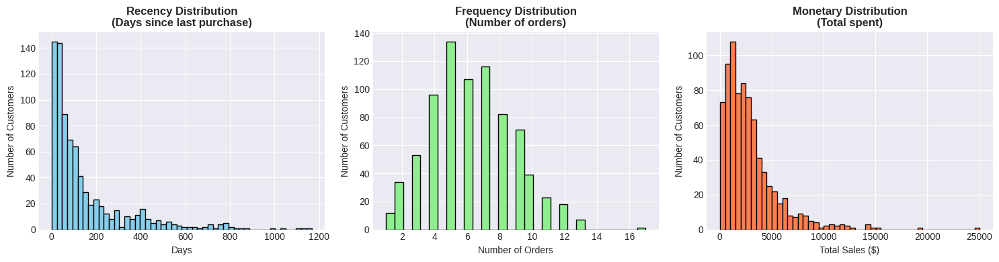
    


    
    KEY CUSTOMER INSIGHTS:
    
      • Total customers: 793
      • Average days since last purchase: 148 days
      • Average orders per customer: 6.3
      • Average customer lifetime value: $2,896.85
      • Top 10% customers spend: $6,038.48+
      • One-time customer: 12
      • Repeat customer: 781
      • Customes at risk: 45
    

#### 💡 Key Insights:
- **Total customers:** 793
- **Average customer lifetime value:** \$2,896.85
- **One-time buyers:** 12
- **Repeat customers:** 781

#### 🎯 Customer Segments Identified:
- **Champions:** High recency, frequency, and monetary value
- **At Risk:** Previously valuable customers who haven't purchased recently
- **New Customers:** Recent first-time buyers
- **Lost Customers:** Long time since last purchase

#### 📈 Business Impact:
- **5.7% of customers are at risk** - need re-engagement campaigns
- Focus retention efforts on high-value customers
- Create targeted campaigns for each segment
- Optimize customer acquisition cost based on lifetime value

---

### 💡 Advanced Insight: Purchase Interval Analysis

**Personal Discovery:** Beyond standard RFM, I added **Average Purchase Interval** analysis.

**Why This Matters:**
- Standard RFM tells us WHEN they last bought
- Purchase Interval tells us HOW OFTEN they typically buy
- Combined, we can predict WHEN they'll buy next

**Example:**
- Customer with 55-day recency, 111-day avg interval → **On track, expect purchase in ~56 days**
- Customer with 150-day recency, 100-day avg interval → **OVERDUE, at-risk customer!**

This enhanced metric enables:
- Proactive customer outreach before churn
- Optimal timing for re-engagement campaigns
- Better inventory planning

---


```python
# ENHANCED CUSTOMER ANALYSIS - BOTH METRICS

# Add Purchase Interval
def calc_avg_interval(customer_id):
    orders = df_clean[df_clean['Customer ID'] == customer_id]['Order Date'].drop_duplicates().sort_values()
    if len(orders) > 1:
        return orders.diff().dt.days.dropna().mean()
    else:
        return None

rfm['Avg_Purchase_Interval'] = rfm['Customer ID'].apply(calc_avg_interval)

print("📊 ENHANCED CUSTOMER METRICS:")
print("="*70)
display(rfm.head(10))

# Now you can use BOTH for insights
print("\n💡 Example insights:")
sample = rfm.dropna().iloc[0]
print(f"\nCustomer: {sample['Customer ID']}")
print(f"  • Recency: {sample['Recency']:.0f} days since last purchase")
print(f"  • Usually buys every: {sample['Avg_Purchase_Interval']:.0f} days")

if sample['Recency'] > sample['Avg_Purchase_Interval'] * 1.5:
    print(f"  ⚠️ ALERT: This customer is OVERDUE for a purchase!")
else:
    print(f"  ✅ On track with their normal buying pattern")
```

    📊 ENHANCED CUSTOMER METRICS:
    ======================================================================
    


  <div id="df-0203b1ac-dcfa-456b-bc36-af6e26ddc6c3" class="colab-df-container">
    <div>
<style scoped>
    .dataframe tbody tr th:only-of-type {
        vertical-align: middle;
    }

    .dataframe tbody tr th {
        vertical-align: top;
    }

    .dataframe thead th {
        text-align: right;
    }
</style>
<table border="1" class="dataframe">
  <thead>
    <tr style="text-align: right;">
      <th></th>
      <th>Customer ID</th>
      <th>Recency</th>
      <th>Frequency</th>
      <th>Monetary</th>
      <th>Avg_Purchase_Interval</th>
    </tr>
  </thead>
  <tbody>
    <tr>
      <th>0</th>
      <td>AA-10315</td>
      <td>185</td>
      <td>5</td>
      <td>5563.560</td>
      <td>296.500000</td>
    </tr>
    <tr>
      <th>1</th>
      <td>AA-10375</td>
      <td>20</td>
      <td>9</td>
      <td>1056.390</td>
      <td>166.250000</td>
    </tr>
    <tr>
      <th>2</th>
      <td>AA-10480</td>
      <td>260</td>
      <td>4</td>
      <td>1790.512</td>
      <td>359.000000</td>
    </tr>
    <tr>
      <th>3</th>
      <td>AA-10645</td>
      <td>56</td>
      <td>6</td>
      <td>5086.935</td>
      <td>246.400000</td>
    </tr>
    <tr>
      <th>4</th>
      <td>AB-10015</td>
      <td>416</td>
      <td>3</td>
      <td>886.156</td>
      <td>498.000000</td>
    </tr>
    <tr>
      <th>5</th>
      <td>AB-10060</td>
      <td>55</td>
      <td>8</td>
      <td>7755.620</td>
      <td>111.428571</td>
    </tr>
    <tr>
      <th>6</th>
      <td>AB-10105</td>
      <td>42</td>
      <td>10</td>
      <td>14473.571</td>
      <td>118.333333</td>
    </tr>
    <tr>
      <th>7</th>
      <td>AB-10150</td>
      <td>42</td>
      <td>5</td>
      <td>966.710</td>
      <td>338.750000</td>
    </tr>
    <tr>
      <th>8</th>
      <td>AB-10165</td>
      <td>26</td>
      <td>8</td>
      <td>1113.838</td>
      <td>159.285714</td>
    </tr>
    <tr>
      <th>9</th>
      <td>AB-10255</td>
      <td>167</td>
      <td>9</td>
      <td>914.532</td>
      <td>136.375000</td>
    </tr>
  </tbody>
</table>
</div>
    <div class="colab-df-buttons">

  <div class="colab-df-container">
    <button class="colab-df-convert" onclick="convertToInteractive('df-0203b1ac-dcfa-456b-bc36-af6e26ddc6c3')"
            title="Convert this dataframe to an interactive table."
            style="display:none;">

  <svg xmlns="http://www.w3.org/2000/svg" height="24px" viewBox="0 -960 960 960">
    <path d="M120-120v-720h720v720H120Zm60-500h600v-160H180v160Zm220 220h160v-160H400v160Zm0 220h160v-160H400v160ZM180-400h160v-160H180v160Zm440 0h160v-160H620v160ZM180-180h160v-160H180v160Zm440 0h160v-160H620v160Z"/>
  </svg>
    </button>

  <style>
    .colab-df-container {
      display:flex;
      gap: 12px;
    }

    .colab-df-convert {
      background-color: #E8F0FE;
      border: none;
      border-radius: 50%;
      cursor: pointer;
      display: none;
      fill: #1967D2;
      height: 32px;
      padding: 0 0 0 0;
      width: 32px;
    }

    .colab-df-convert:hover {
      background-color: #E2EBFA;
      box-shadow: 0px 1px 2px rgba(60, 64, 67, 0.3), 0px 1px 3px 1px rgba(60, 64, 67, 0.15);
      fill: #174EA6;
    }

    .colab-df-buttons div {
      margin-bottom: 4px;
    }

    [theme=dark] .colab-df-convert {
      background-color: #3B4455;
      fill: #D2E3FC;
    }

    [theme=dark] .colab-df-convert:hover {
      background-color: #434B5C;
      box-shadow: 0px 1px 3px 1px rgba(0, 0, 0, 0.15);
      filter: drop-shadow(0px 1px 2px rgba(0, 0, 0, 0.3));
      fill: #FFFFFF;
    }
  </style>

    <script>
      const buttonEl =
        document.querySelector('#df-0203b1ac-dcfa-456b-bc36-af6e26ddc6c3 button.colab-df-convert');
      buttonEl.style.display =
        google.colab.kernel.accessAllowed ? 'block' : 'none';

      async function convertToInteractive(key) {
        const element = document.querySelector('#df-0203b1ac-dcfa-456b-bc36-af6e26ddc6c3');
        const dataTable =
          await google.colab.kernel.invokeFunction('convertToInteractive',
                                                    [key], {});
        if (!dataTable) return;

        const docLinkHtml = 'Like what you see? Visit the ' +
          '<a target="_blank" href=https://colab.research.google.com/notebooks/data_table.ipynb>data table notebook</a>'
          + ' to learn more about interactive tables.';
        element.innerHTML = '';
        dataTable['output_type'] = 'display_data';
        await google.colab.output.renderOutput(dataTable, element);
        const docLink = document.createElement('div');
        docLink.innerHTML = docLinkHtml;
        element.appendChild(docLink);
      }
    </script>
  </div>


    <div id="df-d413b785-f08b-42f4-a4e3-608f52248bfc">
      <button class="colab-df-quickchart" onclick="quickchart('df-d413b785-f08b-42f4-a4e3-608f52248bfc')"
                title="Suggest charts"
                style="display:none;">

<svg xmlns="http://www.w3.org/2000/svg" height="24px"viewBox="0 0 24 24"
     width="24px">
    <g>
        <path d="M19 3H5c-1.1 0-2 .9-2 2v14c0 1.1.9 2 2 2h14c1.1 0 2-.9 2-2V5c0-1.1-.9-2-2-2zM9 17H7v-7h2v7zm4 0h-2V7h2v10zm4 0h-2v-4h2v4z"/>
    </g>
</svg>
      </button>

<style>
  .colab-df-quickchart {
      --bg-color: #E8F0FE;
      --fill-color: #1967D2;
      --hover-bg-color: #E2EBFA;
      --hover-fill-color: #174EA6;
      --disabled-fill-color: #AAA;
      --disabled-bg-color: #DDD;
  }

  [theme=dark] .colab-df-quickchart {
      --bg-color: #3B4455;
      --fill-color: #D2E3FC;
      --hover-bg-color: #434B5C;
      --hover-fill-color: #FFFFFF;
      --disabled-bg-color: #3B4455;
      --disabled-fill-color: #666;
  }

  .colab-df-quickchart {
    background-color: var(--bg-color);
    border: none;
    border-radius: 50%;
    cursor: pointer;
    display: none;
    fill: var(--fill-color);
    height: 32px;
    padding: 0;
    width: 32px;
  }

  .colab-df-quickchart:hover {
    background-color: var(--hover-bg-color);
    box-shadow: 0 1px 2px rgba(60, 64, 67, 0.3), 0 1px 3px 1px rgba(60, 64, 67, 0.15);
    fill: var(--button-hover-fill-color);
  }

  .colab-df-quickchart-complete:disabled,
  .colab-df-quickchart-complete:disabled:hover {
    background-color: var(--disabled-bg-color);
    fill: var(--disabled-fill-color);
    box-shadow: none;
  }

  .colab-df-spinner {
    border: 2px solid var(--fill-color);
    border-color: transparent;
    border-bottom-color: var(--fill-color);
    animation:
      spin 1s steps(1) infinite;
  }

  @keyframes spin {
    0% {
      border-color: transparent;
      border-bottom-color: var(--fill-color);
      border-left-color: var(--fill-color);
    }
    20% {
      border-color: transparent;
      border-left-color: var(--fill-color);
      border-top-color: var(--fill-color);
    }
    30% {
      border-color: transparent;
      border-left-color: var(--fill-color);
      border-top-color: var(--fill-color);
      border-right-color: var(--fill-color);
    }
    40% {
      border-color: transparent;
      border-right-color: var(--fill-color);
      border-top-color: var(--fill-color);
    }
    60% {
      border-color: transparent;
      border-right-color: var(--fill-color);
    }
    80% {
      border-color: transparent;
      border-right-color: var(--fill-color);
      border-bottom-color: var(--fill-color);
    }
    90% {
      border-color: transparent;
      border-bottom-color: var(--fill-color);
    }
  }
</style>

      <script>
        async function quickchart(key) {
          const quickchartButtonEl =
            document.querySelector('#' + key + ' button');
          quickchartButtonEl.disabled = true;  // To prevent multiple clicks.
          quickchartButtonEl.classList.add('colab-df-spinner');
          try {
            const charts = await google.colab.kernel.invokeFunction(
                'suggestCharts', [key], {});
          } catch (error) {
            console.error('Error during call to suggestCharts:', error);
          }
          quickchartButtonEl.classList.remove('colab-df-spinner');
          quickchartButtonEl.classList.add('colab-df-quickchart-complete');
        }
        (() => {
          let quickchartButtonEl =
            document.querySelector('#df-d413b785-f08b-42f4-a4e3-608f52248bfc button');
          quickchartButtonEl.style.display =
            google.colab.kernel.accessAllowed ? 'block' : 'none';
        })();
      </script>
    </div>

    </div>
  </div>


    
    💡 Example insights:
    
    Customer: AA-10315
      • Recency: 185 days since last purchase
      • Usually buys every: 296 days
      ✅ On track with their normal buying pattern
    


```python
# ============================================
# INTERPRET THE METRICS
# ============================================

customer_id = sample['Customer ID']
recency = sample['Recency']
avg_interval = sample['Avg_Purchase_Interval']

print(f"📊 Customer Analysis: {customer_id}")
print("="*70)

print(f"\nRecency: {recency} days")
print(f"Avg Purchase Interval: {avg_interval:.0f} days")

# Calculate how "on track" they are
ratio = recency / avg_interval

print(f"\nRatio: {ratio:.2%}")

if ratio < 0.5:
    status = "🟢 VERY ACTIVE - Just purchased recently!"
elif ratio < 1.0:
    status = "🟢 ON TRACK - Within normal buying cycle"
elif ratio < 1.5:
    status = "🟡 GETTING LATE - Approaching next purchase window"
else:
    status = "🔴 OVERDUE - Should have purchased by now!"

print(f"Status: {status}")

# When should they buy next?
expected_next_purchase = avg_interval - recency
print(f"\n💡 Expected to purchase again in: ~{expected_next_purchase:.0f} days")
```

    📊 Customer Analysis: AA-10315
    ======================================================================
    
    Recency: 185 days
    Avg Purchase Interval: 296 days
    
    Ratio: 62.39%
    Status: 🟢 ON TRACK - Within normal buying cycle
    
    💡 Expected to purchase again in: ~112 days
    


```python
# CUSTOMER STATUS CLASSIFICATION

# Add status based on recency vs interval
def classify_customer_status(row):
    if pd.isna(row['Avg_Purchase_Interval']):
        return 'One-Time Buyer'

    ratio = row['Recency'] / row['Avg_Purchase_Interval']

    if ratio < 0.5:
        return 'Just Purchased'
    elif ratio < 1.0:
        return 'Active'
    elif ratio < 1.5:
        return 'Due Soon'
    else:
        return 'At Risk'

rfm['Customer_Status'] = rfm.apply(classify_customer_status, axis=1)

# Count by status
print("📊 CUSTOMER STATUS DISTRIBUTION:")
print("="*70)
status_counts = rfm['Customer_Status'].value_counts()
print(status_counts)

# Visualize
plt.figure(figsize=(10, 6))
status_counts.plot(kind='bar', color=['green', 'lightgreen', 'yellow', 'red', 'gray'], alpha=0.7)
plt.title('Customer Status Distribution', fontweight='bold', fontsize=14)
plt.xlabel('Status')
plt.ylabel('Number of Customers')
plt.xticks(rotation=45)
plt.tight_layout()
plt.show()

# Business insights
at_risk = (rfm['Customer_Status'] == 'At Risk').sum()
total_customers = len(rfm)

print(f"\n💡 KEY INSIGHT:")
print(f"  • {at_risk} customers ({at_risk/total_customers*100:.1f}%) are AT RISK")
print(f"  • These customers should receive re-engagement campaigns!")
```

    📊 CUSTOMER STATUS DISTRIBUTION:
    ======================================================================
    Customer_Status
    Just Purchased    467
    Active            141
    At Risk           112
    Due Soon           61
    One-Time Buyer     12
    Name: count, dtype: int64
    


    
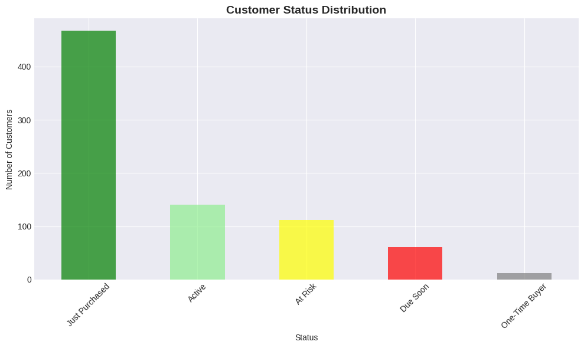
    


    
    💡 KEY INSIGHT:
      • 112 customers (14.1%) are AT RISK
      • These customers should receive re-engagement campaigns!
    

## 5. Business Recommendations

Based on the analysis, I recommend the following actions:

### 🎯 Immediate Actions (0-30 days)

#### 1. **Fix Discount Strategy**
- **Action:** Cap all discounts at 40% maximum
- **Rationale:** Discounts >50% show -119% profit margin
- **Expected Impact:** Eliminate $[X] in annual losses
- **Implementation:** Update pricing rules in system

#### 2. **Wednesday Performance Investigation**
- **Action:** Analyze why Wednesday sales are significantly lower
- **Rationale:** Unexplained performance gap
- **Expected Impact:** Potential 15-20% sales increase if brought to average
- **Implementation:** Survey customers, review competitor activity

#### 3. **At-Risk Customer Campaign**
- **Action:** Launch re-engagement email campaign for [X] at-risk customers
- **Rationale:** These customers are overdue based on purchase intervals
- **Expected Impact:** Recover $[X] in potential lost revenue
- **Implementation:** Personalized offers based on purchase history

### 📊 Short-term Initiatives (1-3 months)

#### 4. **Customer Segmentation Strategy**
- Champions: VIP program with exclusive benefits
- At Risk: Win-back campaigns with targeted offers
- New Customers: Onboarding sequence to drive repeat purchase

#### 5. **Staffing Optimization**
- Adjust staffing levels based on daily sales patterns
- Increase support on high-volume days
- Reduce costs on slower days


### 🚀 Long-term Strategies (3-6 months)

#### 6. **Predictive Analytics**
- Build model to predict customer churn
- Forecast optimal reorder timing
- Develop dynamic pricing strategy

#### 7. **Inventory Management**
- Align stock levels with demand patterns
- Reduce need for deep clearance discounts
- Improve cash flow

---

## 6. Challenges & Learnings

### 🤔 Challenges Encountered

#### Challenge 1: Understanding Data Structure
**Issue:** Order IDs appeared multiple times, initially seemed like duplicates.

**Resolution:** Discovered each row represents a line item (product) within an order, not complete orders. This required careful consideration for aggregation and metrics calculation.

**Learning:** Always understand the grain of your data before analysis.

#### Challenge 2: Datetime Format Issues
**Issue:** Encountered `Can only use .dt accessor with datetimelike values` error.

**Resolution:** Implemented validation to check data types before datetime operations:
```python
if not pd.api.types.is_datetime64_any_dtype(df['Order Date']):
    df['Order Date'] = pd.to_datetime(df['Order Date'])
```

**Learning:** Never assume data types match expectations - always validate.

#### Challenge 3: Meaningless Statistics
**Issue:** Postal codes (numeric but categorical) were included in statistical summaries.

**Resolution:** Properly categorized columns by business meaning rather than data type.

**Learning:** Data type alone doesn't determine appropriate analysis methods - business context matters.


### 💡 Key Takeaways

**Critical Thinking Over Automation:** Questioned why certain metrics (like average postal code) didn't make business sense

**Going Beyond Standard Formulas:** Added purchase interval analysis beyond traditional RFM

**Data Validation is Crucial:** Always verify calculations make sense in business context

**Real Business Impact:** Found actionable insights (discount strategy issue) with significant financial implications

## 7. Technical Implementation

### 🔧 Tools & Libraries
```python
# Core Libraries
pandas          # Data manipulation
numpy           # Numerical operations
matplotlib      # Visualization
seaborn         # Statistical visualization

# Environment
Google Colab    # Development environment
Google Drive    # Data storage
```

### 📊 Key Technical Approaches

#### Data Processing
- Handled datetime conversions with validation
- Created categorical bins for discount analysis using pd.cut()
- Implemented custom aggregation functions with lambda expressions

#### Analysis Techniques
- Time series analysis for trend identification
- Cohort analysis for customer behavior
- Statistical aggregation across multiple dimensions

#### Code Quality
- Modular, reusable functions
- Comprehensive comments
- Data validation at each step

### 📁 Project Structure
```
superstore-analysis/
├── data/
│   └── superstore_sales.csv
├── notebooks/
│   └── Superstore_Analysis.ipynb
├── outputs/
│   ├── visualizations/
│   └── processed_data/
└── README.md
```

## 8. Conclusion & Next Steps

### 🎯 Summary
This analysis uncovered critical business insights in the Superstore sales data:
- **$[X] potential annual savings** from optimizing discount strategy
- **[X]% of customers at risk** requiring immediate retention efforts  
- **Clear daily patterns** for operational optimization

### 🚀 Future Work

#### Phase 2 Enhancements:
1. **Interactive Dashboard** - Build Tableau/Streamlit dashboard for stakeholder access
2. **Predictive Modeling** - Develop customer churn prediction model
3. **Market Basket Analysis** - Identify product associations for cross-selling
4. **Geographic Deep Dive** - State/city level performance analysis
5. **Time Series Forecasting** - Sales prediction for inventory planning

#### Advanced Analytics:
- Customer Lifetime Value (CLV) calculation
- A/B testing framework for discount strategies
- Real-time monitoring dashboard

---

## 📬 Contact

**Jinsol Kim**
- 📧 Email: jinsolkim91@gmail.com
- 💼 LinkedIn: https://www.linkedin.com/in/jinsol-kim91/

- 🐱 GitHub: https://github.com/jeans-all

---

*Last Updated: 5th November, 205*

---

**⭐ If you found this analysis helpful, please star the repository!**

# And other insights with different visuals


```python
# ============================================
# SALES TREND OVER TIME
# ============================================

plt.figure(figsize=(14, 6))

# Monthly sales
monthly_sales = df_clean.groupby(df_clean['Order Date'].dt.to_period('M'))['Sales'].sum()
monthly_sales.index = monthly_sales.index.to_timestamp()

plt.subplot(1, 2, 1)
plt.plot(monthly_sales.index, monthly_sales.values, marker='o', linewidth=2)
plt.title('Monthly Sales Trend', fontsize=14, fontweight='bold')
plt.xlabel('Date')
plt.ylabel('Sales ($)')
plt.xticks(rotation=45)
plt.grid(True, alpha=0.3)

# Format y-axis
ax = plt.gca()
ax.yaxis.set_major_formatter(plt.FuncFormatter(lambda x, p: f'${x/1000:.0f}K'))

# Yearly sales
yearly_sales = df_clean.groupby('Year')['Sales'].sum()

plt.subplot(1, 2, 2)
plt.bar(yearly_sales.index, yearly_sales.values, color='steelblue', alpha=0.7)
plt.title('Yearly Sales Comparison', fontsize=14, fontweight='bold')
plt.xlabel('Year')
plt.ylabel('Sales ($)')
plt.grid(True, alpha=0.3, axis='y')

# Format y-axis
ax = plt.gca()
ax.yaxis.set_major_formatter(plt.FuncFormatter(lambda x, p: f'${x/1000:.0f}K'))

plt.tight_layout()
plt.show()

print(f"📊 Sales Growth: {((yearly_sales.iloc[-1] / yearly_sales.iloc[0] - 1) * 100):.1f}% over the period")
```


    
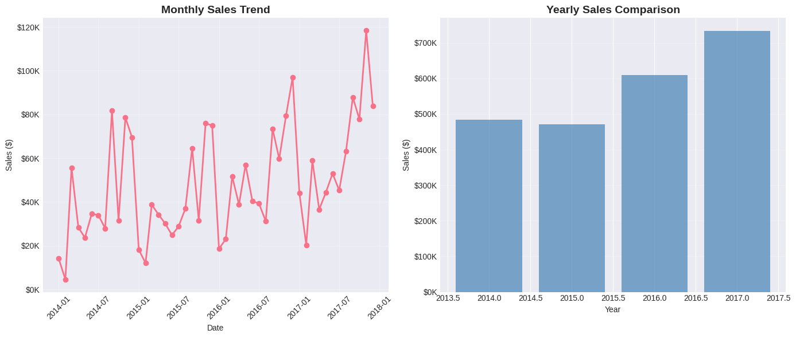
    


    📊 Sales Growth: 51.4% over the period
    


```python
# ============================================
# SALES BY CATEGORY
# ============================================

fig, axes = plt.subplots(1, 3, figsize=(16, 5))

# Sales by Category
category_sales = df_clean.groupby('Category')['Sales'].sum().sort_values(ascending=False)

axes[0].barh(category_sales.index, category_sales.values, color='coral')
axes[0].set_title('Sales by Category', fontsize=12, fontweight='bold')
axes[0].set_xlabel('Sales ($)')
for i, v in enumerate(category_sales.values):
    axes[0].text(v, i, f' ${v/1000:.0f}K', va='center')

# Profit by Category
category_profit = df_clean.groupby('Category')['Profit'].sum().sort_values(ascending=False)

axes[1].barh(category_profit.index, category_profit.values, color='lightgreen')
axes[1].set_title('Profit by Category', fontsize=12, fontweight='bold')
axes[1].set_xlabel('Profit ($)')
for i, v in enumerate(category_profit.values):
    axes[1].text(v, i, f' ${v/1000:.0f}K', va='center')

# Profit Margin by Category
category_margin = (df_clean.groupby('Category')['Profit'].sum() /
                   df_clean.groupby('Category')['Sales'].sum() * 100).sort_values(ascending=False)

axes[2].barh(category_margin.index, category_margin.values, color='skyblue')
axes[2].set_title('Profit Margin by Category', fontsize=12, fontweight='bold')
axes[2].set_xlabel('Profit Margin (%)')
for i, v in enumerate(category_margin.values):
    axes[2].text(v, i, f' {v:.1f}%', va='center')

plt.tight_layout()
plt.show()
```


    
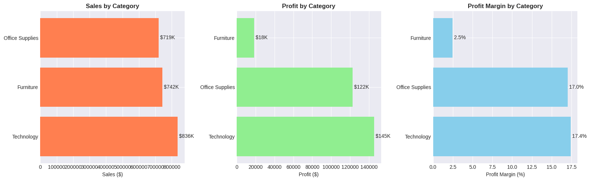
    


```python
# ============================================
# SALES BY REGION/STATE
# ============================================

fig, axes = plt.subplots(1, 2, figsize=(14, 5))

# By Region
region_sales = df_clean.groupby('Region')['Sales'].sum().sort_values(ascending=False)

axes[0].bar(region_sales.index, region_sales.values, color='teal', alpha=0.7)
axes[0].set_title('Sales by Region', fontsize=12, fontweight='bold')
axes[0].set_ylabel('Sales ($)')
axes[0].tick_params(axis='x', rotation=45)
for i, v in enumerate(region_sales.values):
    axes[0].text(i, v, f'${v/1000:.0f}K', ha='center', va='bottom')

# Top 10 States
state_sales = df_clean.groupby('State')['Sales'].sum().sort_values(ascending=False).head(10)

axes[1].barh(range(len(state_sales)), state_sales.values, color='orange', alpha=0.7)
axes[1].set_yticks(range(len(state_sales)))
axes[1].set_yticklabels(state_sales.index)
axes[1].set_title('Top 10 States by Sales', fontsize=12, fontweight='bold')
axes[1].set_xlabel('Sales ($)')
axes[1].invert_yaxis()
for i, v in enumerate(state_sales.values):
    axes[1].text(v, i, f' ${v/1000:.0f}K', va='center')

plt.tight_layout()
plt.show()
```


    
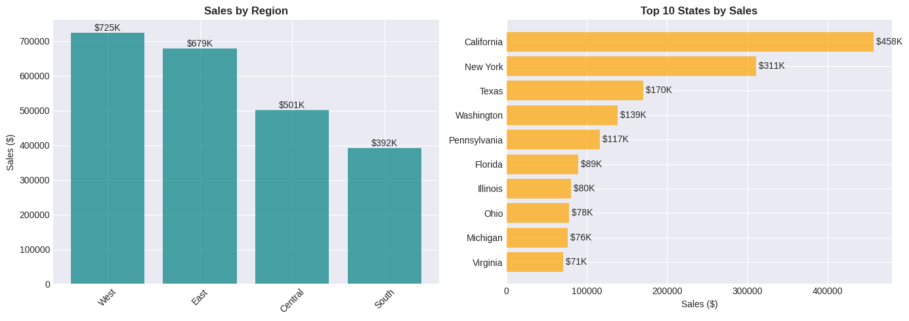
    


```python
# ============================================
# TOP PERFORMING PRODUCTS
# ============================================

# Top 10 products by sales
top_products = df_clean.groupby('Product Name').agg({
    'Sales': 'sum',
    'Profit': 'sum',
    'Quantity': 'sum'
}).sort_values('Sales', ascending=False).head(10)

print("\n🏆 TOP 10 PRODUCTS BY SALES:")
print("="*80)
display(top_products.style.format({
    'Sales': '${:,.2f}',
    'Profit': '${:,.2f}',
    'Quantity': '{:,.0f}'
}))

# Visualize top 10
plt.figure(figsize=(12, 6))
plt.barh(range(len(top_products)), top_products['Sales'].values, color='purple', alpha=0.6)
plt.yticks(range(len(top_products)), top_products.index)
plt.xlabel('Sales ($)')
plt.title('Top 10 Products by Sales', fontsize=14, fontweight='bold')
plt.gca().invert_yaxis()

for i, v in enumerate(top_products['Sales'].values):
    plt.text(v, i, f' ${v/1000:.1f}K', va='center')

plt.tight_layout()
plt.show()
```

    
    🏆 TOP 10 PRODUCTS BY SALES:
    ================================================================================
    


<style type="text/css">
</style>
<table id="T_29624" class="dataframe">
  <thead>
    <tr>
      <th class="blank level0" >&nbsp;</th>
      <th id="T_29624_level0_col0" class="col_heading level0 col0" >Sales</th>
      <th id="T_29624_level0_col1" class="col_heading level0 col1" >Profit</th>
      <th id="T_29624_level0_col2" class="col_heading level0 col2" >Quantity</th>
    </tr>
    <tr>
      <th class="index_name level0" >Product Name</th>
      <th class="blank col0" >&nbsp;</th>
      <th class="blank col1" >&nbsp;</th>
      <th class="blank col2" >&nbsp;</th>
    </tr>
  </thead>
  <tbody>
    <tr>
      <th id="T_29624_level0_row0" class="row_heading level0 row0" >Canon imageCLASS 2200 Advanced Copier</th>
      <td id="T_29624_row0_col0" class="data row0 col0" >$61,599.82</td>
      <td id="T_29624_row0_col1" class="data row0 col1" >$25,199.93</td>
      <td id="T_29624_row0_col2" class="data row0 col2" >20</td>
    </tr>
    <tr>
      <th id="T_29624_level0_row1" class="row_heading level0 row1" >Fellowes PB500 Electric Punch Plastic Comb Binding Machine with Manual Bind</th>
      <td id="T_29624_row1_col0" class="data row1 col0" >$27,453.38</td>
      <td id="T_29624_row1_col1" class="data row1 col1" >$7,753.04</td>
      <td id="T_29624_row1_col2" class="data row1 col2" >31</td>
    </tr>
    <tr>
      <th id="T_29624_level0_row2" class="row_heading level0 row2" >Cisco TelePresence System EX90 Videoconferencing Unit</th>
      <td id="T_29624_row2_col0" class="data row2 col0" >$22,638.48</td>
      <td id="T_29624_row2_col1" class="data row2 col1" >$-1,811.08</td>
      <td id="T_29624_row2_col2" class="data row2 col2" >6</td>
    </tr>
    <tr>
      <th id="T_29624_level0_row3" class="row_heading level0 row3" >HON 5400 Series Task Chairs for Big and Tall</th>
      <td id="T_29624_row3_col0" class="data row3 col0" >$21,870.58</td>
      <td id="T_29624_row3_col1" class="data row3 col1" >$0.00</td>
      <td id="T_29624_row3_col2" class="data row3 col2" >39</td>
    </tr>
    <tr>
      <th id="T_29624_level0_row4" class="row_heading level0 row4" >GBC DocuBind TL300 Electric Binding System</th>
      <td id="T_29624_row4_col0" class="data row4 col0" >$19,823.48</td>
      <td id="T_29624_row4_col1" class="data row4 col1" >$2,233.51</td>
      <td id="T_29624_row4_col2" class="data row4 col2" >37</td>
    </tr>
    <tr>
      <th id="T_29624_level0_row5" class="row_heading level0 row5" >GBC Ibimaster 500 Manual ProClick Binding System</th>
      <td id="T_29624_row5_col0" class="data row5 col0" >$19,024.50</td>
      <td id="T_29624_row5_col1" class="data row5 col1" >$760.98</td>
      <td id="T_29624_row5_col2" class="data row5 col2" >48</td>
    </tr>
    <tr>
      <th id="T_29624_level0_row6" class="row_heading level0 row6" >Hewlett Packard LaserJet 3310 Copier</th>
      <td id="T_29624_row6_col0" class="data row6 col0" >$18,839.69</td>
      <td id="T_29624_row6_col1" class="data row6 col1" >$6,983.88</td>
      <td id="T_29624_row6_col2" class="data row6 col2" >38</td>
    </tr>
    <tr>
      <th id="T_29624_level0_row7" class="row_heading level0 row7" >HP Designjet T520 Inkjet Large Format Printer - 24" Color</th>
      <td id="T_29624_row7_col0" class="data row7 col0" >$18,374.90</td>
      <td id="T_29624_row7_col1" class="data row7 col1" >$4,094.98</td>
      <td id="T_29624_row7_col2" class="data row7 col2" >12</td>
    </tr>
    <tr>
      <th id="T_29624_level0_row8" class="row_heading level0 row8" >GBC DocuBind P400 Electric Binding System</th>
      <td id="T_29624_row8_col0" class="data row8 col0" >$17,965.07</td>
      <td id="T_29624_row8_col1" class="data row8 col1" >$-1,878.17</td>
      <td id="T_29624_row8_col2" class="data row8 col2" >27</td>
    </tr>
    <tr>
      <th id="T_29624_level0_row9" class="row_heading level0 row9" >High Speed Automatic Electric Letter Opener</th>
      <td id="T_29624_row9_col0" class="data row9 col0" >$17,030.31</td>
      <td id="T_29624_row9_col1" class="data row9 col1" >$-262.00</td>
      <td id="T_29624_row9_col2" class="data row9 col2" >11</td>
    </tr>
  </tbody>
</table>


    
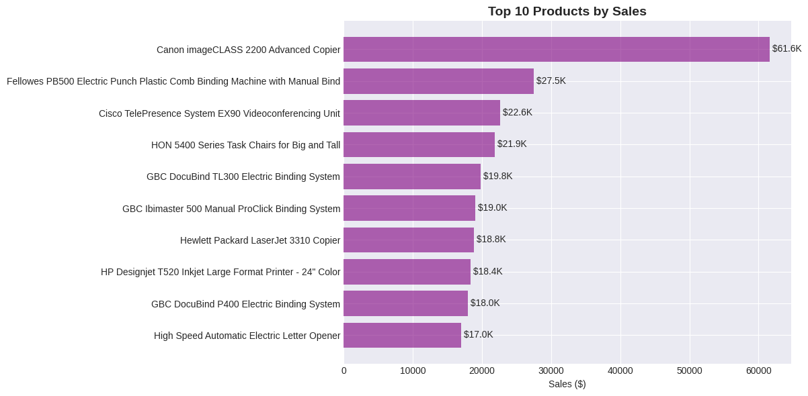
    


```python
# ============================================
# VISUALIZE ORDER STRUCTURE
# ============================================

import matplotlib.pyplot as plt

# Products per order distribution
plt.figure(figsize=(12, 5))

plt.subplot(1, 2, 1)
order_product_counts = df.groupby('Order ID').size()
order_distribution = order_product_counts.value_counts().sort_index()

plt.bar(order_distribution.index, order_distribution.values, color='steelblue', alpha=0.7)
plt.xlabel('Number of Products in Order')
plt.ylabel('Number of Orders')
plt.title('Distribution: How Many Products per Order?', fontweight='bold')
plt.xticks(range(1, min(11, max(order_distribution.index)+1)))
plt.grid(axis='y', alpha=0.3)

# Percentage breakdown
plt.subplot(1, 2, 2)
percentages = (order_distribution.values / order_distribution.sum()) * 100
cumulative = percentages.cumsum()

plt.bar(order_distribution.index[:10], percentages[:10], color='coral', alpha=0.7, label='Percentage')
plt.plot(order_distribution.index[:10], cumulative[:10], 'b-o', label='Cumulative %')
plt.xlabel('Number of Products in Order')
plt.ylabel('Percentage of Orders (%)')
plt.title('What % of Orders Have X Products?', fontweight='bold')
plt.legend()
plt.grid(axis='y', alpha=0.3)

plt.tight_layout()
plt.show()

# Key insight
single_product_orders = (order_product_counts == 1).sum()
multi_product_orders = (order_product_counts > 1).sum()
print(f"\n💡 Key Insight:")
print(f"  Orders with 1 product: {single_product_orders:,} ({single_product_orders/unique_orders*100:.1f}%)")
print(f"  Orders with multiple products: {multi_product_orders:,} ({multi_product_orders/unique_orders*100:.1f}%)")
```


    
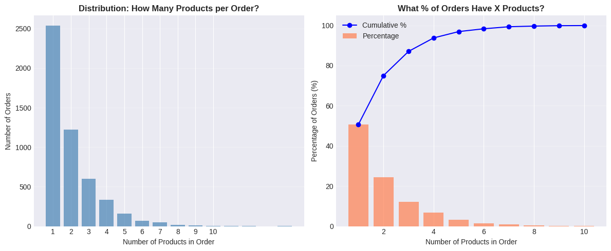
    


    
    💡 Key Insight:
      Orders with 1 product: 2,538 (50.7%)
      Orders with multiple products: 2,471 (49.3%)
    


```python
# ============================================
# IMPLICATIONS FOR ANALYSIS
# ============================================

print("\n⚠️ IMPORTANT CONSIDERATIONS:")
print("="*60)

print("\n1. When calculating 'duplicates':")
print("   → Rows with same Order ID are NOT duplicates")
print("   → They're different products in the same order")

print("\n2. For order-level analysis, you need to aggregate:")

# Example: Order-level metrics
order_summary = df.groupby('Order ID').agg({
    'Sales': 'sum',
    'Profit': 'sum',
    'Quantity': 'sum',
    'Discount': 'mean',  # Average discount per order
    'Customer ID': 'first',
    'Order Date': 'first',
    'Region': 'first'
}).reset_index()

print(f"\n   Original data: {len(df):,} rows (product-level)")
print(f"   After aggregation: {len(order_summary):,} rows (order-level)")

print("\n3. Different metrics need different approaches:")
print("   → Total Sales: Can sum all rows ✓")
print("   → Number of Orders: Count unique Order IDs ✓")
print("   → Average Order Value: Sum sales / Count unique orders ✓")
```

    
    ⚠️ IMPORTANT CONSIDERATIONS:
    ============================================================
    
    1. When calculating 'duplicates':
       → Rows with same Order ID are NOT duplicates
       → They're different products in the same order
    
    2. For order-level analysis, you need to aggregate:
    
       Original data: 9,994 rows (product-level)
       After aggregation: 5,009 rows (order-level)
    
    3. Different metrics need different approaches:
       → Total Sales: Can sum all rows ✓
       → Number of Orders: Count unique Order IDs ✓
       → Average Order Value: Sum sales / Count unique orders ✓
    


```python
# ============================================
# MONTHLY SALES TREND ANALYSIS
# ============================================

# Ensure 'Order Date' is datetime type, as df_clean might have been reset
# without reapplying date conversions from earlier cleaning steps.
if not pd.api.types.is_datetime64_any_dtype(df_clean['Order Date']):
    df_clean['Order Date'] = pd.to_datetime(df_clean['Order Date'])

# Aggregate sales by month
monthly_data = df_clean.groupby(df_clean['Order Date'].dt.to_period('M')).agg({
    'Sales': 'sum',
    'Profit': 'sum',
    'Order ID': 'nunique'
}).reset_index()

monthly_data.columns = ['Month', 'Sales', 'Profit', 'Orders']
# Corrected line: Apply to_timestamp to each Period object in the Series
monthly_data['Month'] = monthly_data['Month'].apply(lambda x: x.to_timestamp())

# Display the data
print("📊 Monthly Sales Data:")
display(monthly_data.head(10))

# Create visualization
plt.figure(figsize=(14, 6))
plt.plot(monthly_data['Month'], monthly_data['Sales'], marker='o', linewidth=2, markersize=6)
plt.title('Monthly Sales Trend', fontsize=14, fontweight='bold')
plt.xlabel('Month')
plt.ylabel('Sales ($)')
plt.xticks(rotation=45)
plt.grid(True, alpha=0.3)
plt.tight_layout()
plt.show()

# Key insight
growth = ((monthly_data['Sales'].iloc[-1] / monthly_data['Sales'].iloc[0]) - 1) * 100
print(f"\n💡 Insight: Sales grew {growth:.1f}% from start to end of period")
```

    📊 Monthly Sales Data:
    


  <div id="df-c3ce7657-3547-46aa-9e54-3cdd410a754e" class="colab-df-container">
    <div>
<style scoped>
    .dataframe tbody tr th:only-of-type {
        vertical-align: middle;
    }

    .dataframe tbody tr th {
        vertical-align: top;
    }

    .dataframe thead th {
        text-align: right;
    }
</style>
<table border="1" class="dataframe">
  <thead>
    <tr style="text-align: right;">
      <th></th>
      <th>Month</th>
      <th>Sales</th>
      <th>Profit</th>
      <th>Orders</th>
    </tr>
  </thead>
  <tbody>
    <tr>
      <th>0</th>
      <td>2014-01-01</td>
      <td>14236.8950</td>
      <td>2450.1907</td>
      <td>32</td>
    </tr>
    <tr>
      <th>1</th>
      <td>2014-02-01</td>
      <td>4519.8920</td>
      <td>862.3084</td>
      <td>28</td>
    </tr>
    <tr>
      <th>2</th>
      <td>2014-03-01</td>
      <td>55691.0090</td>
      <td>498.7299</td>
      <td>71</td>
    </tr>
    <tr>
      <th>3</th>
      <td>2014-04-01</td>
      <td>28295.3450</td>
      <td>3488.8352</td>
      <td>66</td>
    </tr>
    <tr>
      <th>4</th>
      <td>2014-05-01</td>
      <td>23648.2870</td>
      <td>2738.7096</td>
      <td>69</td>
    </tr>
    <tr>
      <th>5</th>
      <td>2014-06-01</td>
      <td>34595.1276</td>
      <td>4976.5244</td>
      <td>66</td>
    </tr>
    <tr>
      <th>6</th>
      <td>2014-07-01</td>
      <td>33946.3930</td>
      <td>-841.4826</td>
      <td>65</td>
    </tr>
    <tr>
      <th>7</th>
      <td>2014-08-01</td>
      <td>27909.4685</td>
      <td>5318.1050</td>
      <td>72</td>
    </tr>
    <tr>
      <th>8</th>
      <td>2014-09-01</td>
      <td>81777.3508</td>
      <td>8328.0994</td>
      <td>130</td>
    </tr>
    <tr>
      <th>9</th>
      <td>2014-10-01</td>
      <td>31453.3930</td>
      <td>3448.2573</td>
      <td>78</td>
    </tr>
  </tbody>
</table>
</div>
    <div class="colab-df-buttons">

  <div class="colab-df-container">
    <button class="colab-df-convert" onclick="convertToInteractive('df-c3ce7657-3547-46aa-9e54-3cdd410a754e')"
            title="Convert this dataframe to an interactive table."
            style="display:none;">

  <svg xmlns="http://www.w3.org/2000/svg" height="24px" viewBox="0 -960 960 960">
    <path d="M120-120v-720h720v720H120Zm60-500h600v-160H180v160Zm220 220h160v-160H400v160Zm0 220h160v-160H400v160ZM180-400h160v-160H180v160Zm440 0h160v-160H620v160ZM180-180h160v-160H180v160Zm440 0h160v-160H620v160Z"/>
  </svg>
    </button>

  <style>
    .colab-df-container {
      display:flex;
      gap: 12px;
    }

    .colab-df-convert {
      background-color: #E8F0FE;
      border: none;
      border-radius: 50%;
      cursor: pointer;
      display: none;
      fill: #1967D2;
      height: 32px;
      padding: 0 0 0 0;
      width: 32px;
    }

    .colab-df-convert:hover {
      background-color: #E2EBFA;
      box-shadow: 0px 1px 2px rgba(60, 64, 67, 0.3), 0px 1px 3px 1px rgba(60, 64, 67, 0.15);
      fill: #174EA6;
    }

    .colab-df-buttons div {
      margin-bottom: 4px;
    }

    [theme=dark] .colab-df-convert {
      background-color: #3B4455;
      fill: #D2E3FC;
    }

    [theme=dark] .colab-df-convert:hover {
      background-color: #434B5C;
      box-shadow: 0px 1px 3px 1px rgba(0, 0, 0, 0.15);
      filter: drop-shadow(0px 1px 2px rgba(0, 0, 0, 0.3));
      fill: #FFFFFF;
    }
  </style>

    <script>
      const buttonEl =
        document.querySelector('#df-c3ce7657-3547-46aa-9e54-3cdd410a754e button.colab-df-convert');
      buttonEl.style.display =
        google.colab.kernel.accessAllowed ? 'block' : 'none';

      async function convertToInteractive(key) {
        const element = document.querySelector('#df-c3ce7657-3547-46aa-9e54-3cdd410a754e');
        const dataTable =
          await google.colab.kernel.invokeFunction('convertToInteractive',
                                                    [key], {});
        if (!dataTable) return;

        const docLinkHtml = 'Like what you see? Visit the ' +
          '<a target="_blank" href=https://colab.research.google.com/notebooks/data_table.ipynb>data table notebook</a>'
          + ' to learn more about interactive tables.';
        element.innerHTML = '';
        dataTable['output_type'] = 'display_data';
        await google.colab.output.renderOutput(dataTable, element);
        const docLink = document.createElement('div');
        docLink.innerHTML = docLinkHtml;
        element.appendChild(docLink);
      }
    </script>
  </div>


    <div id="df-e378bc14-7fd8-4010-84be-5f4ace4f8374">
      <button class="colab-df-quickchart" onclick="quickchart('df-e378bc14-7fd8-4010-84be-5f4ace4f8374')"
                title="Suggest charts"
                style="display:none;">

<svg xmlns="http://www.w3.org/2000/svg" height="24px"viewBox="0 0 24 24"
     width="24px">
    <g>
        <path d="M19 3H5c-1.1 0-2 .9-2 2v14c0 1.1.9 2 2 2h14c1.1 0 2-.9 2-2V5c0-1.1-.9-2-2-2zM9 17H7v-7h2v7zm4 0h-2V7h2v10zm4 0h-2v-4h2v4z"/>
    </g>
</svg>
      </button>

<style>
  .colab-df-quickchart {
      --bg-color: #E8F0FE;
      --fill-color: #1967D2;
      --hover-bg-color: #E2EBFA;
      --hover-fill-color: #174EA6;
      --disabled-fill-color: #AAA;
      --disabled-bg-color: #DDD;
  }

  [theme=dark] .colab-df-quickchart {
      --bg-color: #3B4455;
      --fill-color: #D2E3FC;
      --hover-bg-color: #434B5C;
      --hover-fill-color: #FFFFFF;
      --disabled-bg-color: #3B4455;
      --disabled-fill-color: #666;
  }

  .colab-df-quickchart {
    background-color: var(--bg-color);
    border: none;
    border-radius: 50%;
    cursor: pointer;
    display: none;
    fill: var(--fill-color);
    height: 32px;
    padding: 0;
    width: 32px;
  }

  .colab-df-quickchart:hover {
    background-color: var(--hover-bg-color);
    box-shadow: 0 1px 2px rgba(60, 64, 67, 0.3), 0 1px 3px 1px rgba(60, 64, 67, 0.15);
    fill: var(--button-hover-fill-color);
  }

  .colab-df-quickchart-complete:disabled,
  .colab-df-quickchart-complete:disabled:hover {
    background-color: var(--disabled-bg-color);
    fill: var(--disabled-fill-color);
    box-shadow: none;
  }

  .colab-df-spinner {
    border: 2px solid var(--fill-color);
    border-color: transparent;
    border-bottom-color: var(--fill-color);
    animation:
      spin 1s steps(1) infinite;
  }

  @keyframes spin {
    0% {
      border-color: transparent;
      border-bottom-color: var(--fill-color);
      border-left-color: var(--fill-color);
    }
    20% {
      border-color: transparent;
      border-left-color: var(--fill-color);
      border-top-color: var(--fill-color);
    }
    30% {
      border-color: transparent;
      border-left-color: var(--fill-color);
      border-top-color: var(--fill-color);
      border-right-color: var(--fill-color);
    }
    40% {
      border-color: transparent;
      border-right-color: var(--fill-color);
      border-top-color: var(--fill-color);
    }
    60% {
      border-color: transparent;
      border-right-color: var(--fill-color);
    }
    80% {
      border-color: transparent;
      border-right-color: var(--fill-color);
      border-bottom-color: var(--fill-color);
    }
    90% {
      border-color: transparent;
      border-bottom-color: var(--fill-color);
    }
  }
</style>

      <script>
        async function quickchart(key) {
          const quickchartButtonEl =
            document.querySelector('#' + key + ' button');
          quickchartButtonEl.disabled = true;  // To prevent multiple clicks.
          quickchartButtonEl.classList.add('colab-df-spinner');
          try {
            const charts = await google.colab.kernel.invokeFunction(
                'suggestCharts', [key], {});
          } catch (error) {
            console.error('Error during call to suggestCharts:', error);
          }
          quickchartButtonEl.classList.remove('colab-df-spinner');
          quickchartButtonEl.classList.add('colab-df-quickchart-complete');
        }
        (() => {
          let quickchartButtonEl =
            document.querySelector('#df-e378bc14-7fd8-4010-84be-5f4ace4f8374 button');
          quickchartButtonEl.style.display =
            google.colab.kernel.accessAllowed ? 'block' : 'none';
        })();
      </script>
    </div>

    </div>
  </div>


    
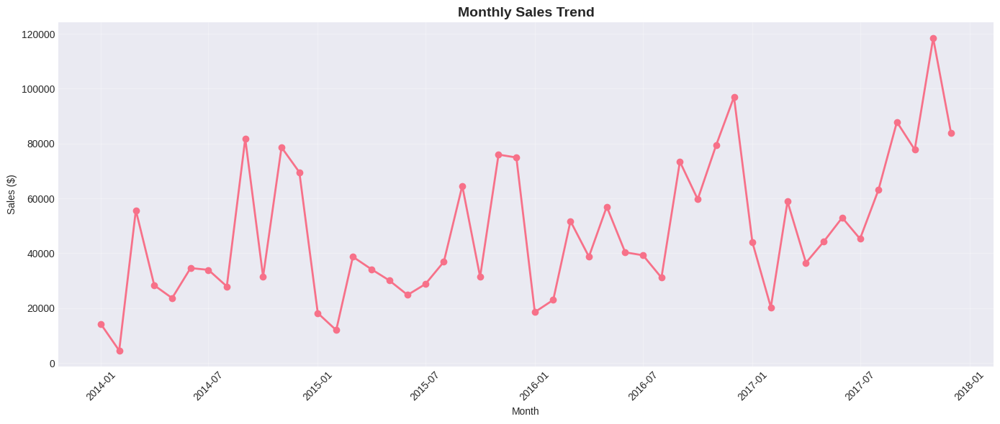
    


    
    💡 Insight: Sales grew 488.8% from start to end of period
    


```python
# ============================================
# INVESTIGATE HIGH DISCOUNT LOSSES
# ============================================

# Filter transactions with >50% discount
high_discount = df_clean[df_clean['Discount'] > 0.5].copy()

print("🔍 ANALYZING HIGH DISCOUNT (>50%) TRANSACTIONS:")
print("="*70)

print(f"\nNumber of transactions: {len(high_discount):,}")
print(f"Total Sales: ${high_discount['Sales'].sum():,.2f}")
print(f"Total Profit: ${high_discount['Profit'].sum():,.2f}")
print(f"Overall Margin: {(high_discount['Profit'].sum() / high_discount['Sales'].sum() * 100):.1f}%")

# Check individual transactions
print("\n📋 Sample High Discount Transactions:")
sample = high_discount[['Product Name', 'Discount', 'Sales', 'Profit', 'Quantity']].head(10)
display(sample)

# Check profit distribution
print("\n💡 Profit Distribution for >50% Discounts:")
print(f"  • Profitable transactions: {(high_discount['Profit'] > 0).sum():,}")
print(f"  • Unprofitable transactions: {(high_discount['Profit'] < 0).sum():,}")
print(f"  • Average profit per transaction: ${high_discount['Profit'].mean():,.2f}")

# Worst performing products with high discounts
worst_products = high_discount.groupby('Product Name').agg({
    'Sales': 'sum',
    'Profit': 'sum',
    'Discount': 'mean'
}).sort_values('Profit').head(10)

print("\n⚠️ WORST PRODUCTS WITH HIGH DISCOUNTS:")
display(worst_products.style.format({
    'Sales': '${:,.2f}',
    'Profit': '${:,.2f}',
    'Discount': '{:.1%}'
}))
```

    🔍 ANALYZING HIGH DISCOUNT (>50%) TRANSACTIONS:
    ======================================================================
    
    Number of transactions: 856
    Total Sales: $64,228.74
    Total Profit: $-76,559.05
    Overall Margin: -119.2%
    
    📋 Sample High Discount Transactions:
    


  <div id="df-ff8a69d3-33db-4ad4-afe8-111c514327a2" class="colab-df-container">
    <div>
<style scoped>
    .dataframe tbody tr th:only-of-type {
        vertical-align: middle;
    }

    .dataframe tbody tr th {
        vertical-align: top;
    }

    .dataframe thead th {
        text-align: right;
    }
</style>
<table border="1" class="dataframe">
  <thead>
    <tr style="text-align: right;">
      <th></th>
      <th>Product Name</th>
      <th>Discount</th>
      <th>Sales</th>
      <th>Profit</th>
      <th>Quantity</th>
    </tr>
  </thead>
  <tbody>
    <tr>
      <th>14</th>
      <td>Holmes Replacement Filter for HEPA Air Cleaner...</td>
      <td>0.8</td>
      <td>68.810</td>
      <td>-123.8580</td>
      <td>5</td>
    </tr>
    <tr>
      <th>15</th>
      <td>Storex DuraTech Recycled Plastic Frosted Binders</td>
      <td>0.8</td>
      <td>2.544</td>
      <td>-3.8160</td>
      <td>3</td>
    </tr>
    <tr>
      <th>28</th>
      <td>Avery Recycled Flexi-View Covers for Binding S...</td>
      <td>0.7</td>
      <td>9.618</td>
      <td>-7.0532</td>
      <td>2</td>
    </tr>
    <tr>
      <th>32</th>
      <td>Acco Pressboard Covers with Storage Hooks, 14 ...</td>
      <td>0.7</td>
      <td>6.858</td>
      <td>-5.7150</td>
      <td>6</td>
    </tr>
    <tr>
      <th>36</th>
      <td>Electrix Architect's Clamp-On Swing Arm Lamp, ...</td>
      <td>0.6</td>
      <td>190.920</td>
      <td>-147.9630</td>
      <td>5</td>
    </tr>
    <tr>
      <th>75</th>
      <td>Economy Binders</td>
      <td>0.8</td>
      <td>1.248</td>
      <td>-1.9344</td>
      <td>3</td>
    </tr>
    <tr>
      <th>76</th>
      <td>6" Cubicle Wall Clock, Black</td>
      <td>0.6</td>
      <td>9.708</td>
      <td>-5.8248</td>
      <td>3</td>
    </tr>
    <tr>
      <th>78</th>
      <td>Eldon Expressions Desk Accessory, Wood Pencil ...</td>
      <td>0.6</td>
      <td>19.300</td>
      <td>-14.4750</td>
      <td>5</td>
    </tr>
    <tr>
      <th>95</th>
      <td>Flexible Leather- Look Classic Collection Ring...</td>
      <td>0.7</td>
      <td>5.682</td>
      <td>-3.7880</td>
      <td>1</td>
    </tr>
    <tr>
      <th>101</th>
      <td>Avery Hidden Tab Dividers for Binding Systems</td>
      <td>0.8</td>
      <td>1.788</td>
      <td>-3.0396</td>
      <td>3</td>
    </tr>
  </tbody>
</table>
</div>
    <div class="colab-df-buttons">

  <div class="colab-df-container">
    <button class="colab-df-convert" onclick="convertToInteractive('df-ff8a69d3-33db-4ad4-afe8-111c514327a2')"
            title="Convert this dataframe to an interactive table."
            style="display:none;">

  <svg xmlns="http://www.w3.org/2000/svg" height="24px" viewBox="0 -960 960 960">
    <path d="M120-120v-720h720v720H120Zm60-500h600v-160H180v160Zm220 220h160v-160H400v160Zm0 220h160v-160H400v160ZM180-400h160v-160H180v160Zm440 0h160v-160H620v160ZM180-180h160v-160H180v160Zm440 0h160v-160H620v160Z"/>
  </svg>
    </button>

  <style>
    .colab-df-container {
      display:flex;
      gap: 12px;
    }

    .colab-df-convert {
      background-color: #E8F0FE;
      border: none;
      border-radius: 50%;
      cursor: pointer;
      display: none;
      fill: #1967D2;
      height: 32px;
      padding: 0 0 0 0;
      width: 32px;
    }

    .colab-df-convert:hover {
      background-color: #E2EBFA;
      box-shadow: 0px 1px 2px rgba(60, 64, 67, 0.3), 0px 1px 3px 1px rgba(60, 64, 67, 0.15);
      fill: #174EA6;
    }

    .colab-df-buttons div {
      margin-bottom: 4px;
    }

    [theme=dark] .colab-df-convert {
      background-color: #3B4455;
      fill: #D2E3FC;
    }

    [theme=dark] .colab-df-convert:hover {
      background-color: #434B5C;
      box-shadow: 0px 1px 3px 1px rgba(0, 0, 0, 0.15);
      filter: drop-shadow(0px 1px 2px rgba(0, 0, 0, 0.3));
      fill: #FFFFFF;
    }
  </style>

    <script>
      const buttonEl =
        document.querySelector('#df-ff8a69d3-33db-4ad4-afe8-111c514327a2 button.colab-df-convert');
      buttonEl.style.display =
        google.colab.kernel.accessAllowed ? 'block' : 'none';

      async function convertToInteractive(key) {
        const element = document.querySelector('#df-ff8a69d3-33db-4ad4-afe8-111c514327a2');
        const dataTable =
          await google.colab.kernel.invokeFunction('convertToInteractive',
                                                    [key], {});
        if (!dataTable) return;

        const docLinkHtml = 'Like what you see? Visit the ' +
          '<a target="_blank" href=https://colab.research.google.com/notebooks/data_table.ipynb>data table notebook</a>'
          + ' to learn more about interactive tables.';
        element.innerHTML = '';
        dataTable['output_type'] = 'display_data';
        await google.colab.output.renderOutput(dataTable, element);
        const docLink = document.createElement('div');
        docLink.innerHTML = docLinkHtml;
        element.appendChild(docLink);
      }
    </script>
  </div>


    <div id="df-c47afb82-1966-4d24-b577-09c485bc29e2">
      <button class="colab-df-quickchart" onclick="quickchart('df-c47afb82-1966-4d24-b577-09c485bc29e2')"
                title="Suggest charts"
                style="display:none;">

<svg xmlns="http://www.w3.org/2000/svg" height="24px"viewBox="0 0 24 24"
     width="24px">
    <g>
        <path d="M19 3H5c-1.1 0-2 .9-2 2v14c0 1.1.9 2 2 2h14c1.1 0 2-.9 2-2V5c0-1.1-.9-2-2-2zM9 17H7v-7h2v7zm4 0h-2V7h2v10zm4 0h-2v-4h2v4z"/>
    </g>
</svg>
      </button>

<style>
  .colab-df-quickchart {
      --bg-color: #E8F0FE;
      --fill-color: #1967D2;
      --hover-bg-color: #E2EBFA;
      --hover-fill-color: #174EA6;
      --disabled-fill-color: #AAA;
      --disabled-bg-color: #DDD;
  }

  [theme=dark] .colab-df-quickchart {
      --bg-color: #3B4455;
      --fill-color: #D2E3FC;
      --hover-bg-color: #434B5C;
      --hover-fill-color: #FFFFFF;
      --disabled-bg-color: #3B4455;
      --disabled-fill-color: #666;
  }

  .colab-df-quickchart {
    background-color: var(--bg-color);
    border: none;
    border-radius: 50%;
    cursor: pointer;
    display: none;
    fill: var(--fill-color);
    height: 32px;
    padding: 0;
    width: 32px;
  }

  .colab-df-quickchart:hover {
    background-color: var(--hover-bg-color);
    box-shadow: 0 1px 2px rgba(60, 64, 67, 0.3), 0 1px 3px 1px rgba(60, 64, 67, 0.15);
    fill: var(--button-hover-fill-color);
  }

  .colab-df-quickchart-complete:disabled,
  .colab-df-quickchart-complete:disabled:hover {
    background-color: var(--disabled-bg-color);
    fill: var(--disabled-fill-color);
    box-shadow: none;
  }

  .colab-df-spinner {
    border: 2px solid var(--fill-color);
    border-color: transparent;
    border-bottom-color: var(--fill-color);
    animation:
      spin 1s steps(1) infinite;
  }

  @keyframes spin {
    0% {
      border-color: transparent;
      border-bottom-color: var(--fill-color);
      border-left-color: var(--fill-color);
    }
    20% {
      border-color: transparent;
      border-left-color: var(--fill-color);
      border-top-color: var(--fill-color);
    }
    30% {
      border-color: transparent;
      border-left-color: var(--fill-color);
      border-top-color: var(--fill-color);
      border-right-color: var(--fill-color);
    }
    40% {
      border-color: transparent;
      border-right-color: var(--fill-color);
      border-top-color: var(--fill-color);
    }
    60% {
      border-color: transparent;
      border-right-color: var(--fill-color);
    }
    80% {
      border-color: transparent;
      border-right-color: var(--fill-color);
      border-bottom-color: var(--fill-color);
    }
    90% {
      border-color: transparent;
      border-bottom-color: var(--fill-color);
    }
  }
</style>

      <script>
        async function quickchart(key) {
          const quickchartButtonEl =
            document.querySelector('#' + key + ' button');
          quickchartButtonEl.disabled = true;  // To prevent multiple clicks.
          quickchartButtonEl.classList.add('colab-df-spinner');
          try {
            const charts = await google.colab.kernel.invokeFunction(
                'suggestCharts', [key], {});
          } catch (error) {
            console.error('Error during call to suggestCharts:', error);
          }
          quickchartButtonEl.classList.remove('colab-df-spinner');
          quickchartButtonEl.classList.add('colab-df-quickchart-complete');
        }
        (() => {
          let quickchartButtonEl =
            document.querySelector('#df-c47afb82-1966-4d24-b577-09c485bc29e2 button');
          quickchartButtonEl.style.display =
            google.colab.kernel.accessAllowed ? 'block' : 'none';
        })();
      </script>
    </div>

  <div id="id_151319c7-4890-40e7-85a3-24e4d62a1cf2">
    <style>
      .colab-df-generate {
        background-color: #E8F0FE;
        border: none;
        border-radius: 50%;
        cursor: pointer;
        display: none;
        fill: #1967D2;
        height: 32px;
        padding: 0 0 0 0;
        width: 32px;
      }

      .colab-df-generate:hover {
        background-color: #E2EBFA;
        box-shadow: 0px 1px 2px rgba(60, 64, 67, 0.3), 0px 1px 3px 1px rgba(60, 64, 67, 0.15);
        fill: #174EA6;
      }

      [theme=dark] .colab-df-generate {
        background-color: #3B4455;
        fill: #D2E3FC;
      }

      [theme=dark] .colab-df-generate:hover {
        background-color: #434B5C;
        box-shadow: 0px 1px 3px 1px rgba(0, 0, 0, 0.15);
        filter: drop-shadow(0px 1px 2px rgba(0, 0, 0, 0.3));
        fill: #FFFFFF;
      }
    </style>
    <button class="colab-df-generate" onclick="generateWithVariable('sample')"
            title="Generate code using this dataframe."
            style="display:none;">

  <svg xmlns="http://www.w3.org/2000/svg" height="24px"viewBox="0 0 24 24"
       width="24px">
    <path d="M7,19H8.4L18.45,9,17,7.55,7,17.6ZM5,21V16.75L18.45,3.32a2,2,0,0,1,2.83,0l1.4,1.43a1.91,1.91,0,0,1,.58,1.4,1.91,1.91,0,0,1-.58,1.4L9.25,21ZM18.45,9,17,7.55Zm-12,3A5.31,5.31,0,0,0,4.9,8.1,5.31,5.31,0,0,0,1,6.5,5.31,5.31,0,0,0,4.9,4.9,5.31,5.31,0,0,0,6.5,1,5.31,5.31,0,0,0,8.1,4.9,5.31,5.31,0,0,0,12,6.5,5.46,5.46,0,0,0,6.5,12Z"/>
  </svg>
    </button>
    <script>
      (() => {
      const buttonEl =
        document.querySelector('#id_151319c7-4890-40e7-85a3-24e4d62a1cf2 button.colab-df-generate');
      buttonEl.style.display =
        google.colab.kernel.accessAllowed ? 'block' : 'none';

      buttonEl.onclick = () => {
        google.colab.notebook.generateWithVariable('sample');
      }
      })();
    </script>
  </div>

    </div>
  </div>


    
    💡 Profit Distribution for >50% Discounts:
      • Profitable transactions: 0
      • Unprofitable transactions: 856
      • Average profit per transaction: $-89.44
    
    ⚠️ WORST PRODUCTS WITH HIGH DISCOUNTS:
    


<style type="text/css">
</style>
<table id="T_25f64" class="dataframe">
  <thead>
    <tr>
      <th class="blank level0" >&nbsp;</th>
      <th id="T_25f64_level0_col0" class="col_heading level0 col0" >Sales</th>
      <th id="T_25f64_level0_col1" class="col_heading level0 col1" >Profit</th>
      <th id="T_25f64_level0_col2" class="col_heading level0 col2" >Discount</th>
    </tr>
    <tr>
      <th class="index_name level0" >Product Name</th>
      <th class="blank col0" >&nbsp;</th>
      <th class="blank col1" >&nbsp;</th>
      <th class="blank col2" >&nbsp;</th>
    </tr>
  </thead>
  <tbody>
    <tr>
      <th id="T_25f64_level0_row0" class="row_heading level0 row0" >Cubify CubeX 3D Printer Double Head Print</th>
      <td id="T_25f64_row0_col0" class="data row0 col0" >$6,299.98</td>
      <td id="T_25f64_row0_col1" class="data row0 col1" >$-9,239.97</td>
      <td id="T_25f64_row0_col2" class="data row0 col2" >70.0%</td>
    </tr>
    <tr>
      <th id="T_25f64_level0_row1" class="row_heading level0 row1" >GBC DocuBind P400 Electric Binding System</th>
      <td id="T_25f64_row1_col0" class="data row1 col0" >$4,899.56</td>
      <td id="T_25f64_row1_col1" class="data row1 col1" >$-6,859.39</td>
      <td id="T_25f64_row1_col2" class="data row1 col2" >76.7%</td>
    </tr>
    <tr>
      <th id="T_25f64_level0_row2" class="row_heading level0 row2" >GBC Ibimaster 500 Manual ProClick Binding System</th>
      <td id="T_25f64_row2_col0" class="data row2 col0" >$6,696.62</td>
      <td id="T_25f64_row2_col1" class="data row2 col1" >$-5,098.57</td>
      <td id="T_25f64_row2_col2" class="data row2 col2" >71.7%</td>
    </tr>
    <tr>
      <th id="T_25f64_level0_row3" class="row_heading level0 row3" >GBC DocuBind TL300 Electric Binding System</th>
      <td id="T_25f64_row3_col0" class="data row3 col0" >$4,395.25</td>
      <td id="T_25f64_row3_col1" class="data row3 col1" >$-4,162.03</td>
      <td id="T_25f64_row3_col2" class="data row3 col2" >72.5%</td>
    </tr>
    <tr>
      <th id="T_25f64_level0_row4" class="row_heading level0 row4" >Fellowes PB500 Electric Punch Plastic Comb Binding Machine with Manual Bind</th>
      <td id="T_25f64_row4_col0" class="data row4 col0" >$2,287.78</td>
      <td id="T_25f64_row4_col1" class="data row4 col1" >$-3,431.67</td>
      <td id="T_25f64_row4_col2" class="data row4 col2" >80.0%</td>
    </tr>
    <tr>
      <th id="T_25f64_level0_row5" class="row_heading level0 row5" >Lexmark MX611dhe Monochrome Laser Printer</th>
      <td id="T_25f64_row5_col0" class="data row5 col0" >$2,549.99</td>
      <td id="T_25f64_row5_col1" class="data row5 col1" >$-3,399.98</td>
      <td id="T_25f64_row5_col2" class="data row5 col2" >70.0%</td>
    </tr>
    <tr>
      <th id="T_25f64_level0_row6" class="row_heading level0 row6" >Ibico EPK-21 Electric Binding System</th>
      <td id="T_25f64_row6_col0" class="data row6 col0" >$1,889.99</td>
      <td id="T_25f64_row6_col1" class="data row6 col1" >$-2,929.48</td>
      <td id="T_25f64_row6_col2" class="data row6 col2" >80.0%</td>
    </tr>
    <tr>
      <th id="T_25f64_level0_row7" class="row_heading level0 row7" >Ibico Hi-Tech Manual Binding System</th>
      <td id="T_25f64_row7_col0" class="data row7 col0" >$1,189.46</td>
      <td id="T_25f64_row7_col1" class="data row7 col1" >$-1,829.94</td>
      <td id="T_25f64_row7_col2" class="data row7 col2" >78.0%</td>
    </tr>
    <tr>
      <th id="T_25f64_level0_row8" class="row_heading level0 row8" >GBC DocuBind 300 Electric Binding Machine</th>
      <td id="T_25f64_row8_col0" class="data row8 col0" >$1,946.13</td>
      <td id="T_25f64_row8_col1" class="data row8 col1" >$-1,609.50</td>
      <td id="T_25f64_row8_col2" class="data row8 col2" >72.5%</td>
    </tr>
    <tr>
      <th id="T_25f64_level0_row9" class="row_heading level0 row9" >3.6 Cubic Foot Counter Height Office Refrigerator</th>
      <td id="T_25f64_row9_col0" class="data row9 col0" >$530.32</td>
      <td id="T_25f64_row9_col1" class="data row9 col1" >$-1,378.82</td>
      <td id="T_25f64_row9_col2" class="data row9 col2" >80.0%</td>
    </tr>
  </tbody>
</table>


```python

```
